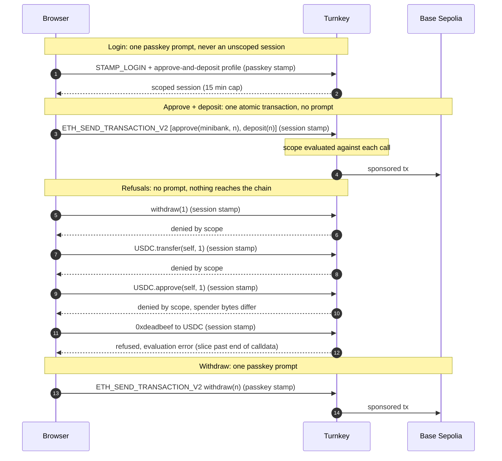

# Example: `with-scoped-deposit-session`

A browser session that can deposit USDC into a vault but is not scoped to withdraw or transfer it.

The question this answers: if a user's browser session is stolen, can the
attacker withdraw? With Turnkey [session profiles](https://docs.turnkey.com/features/authentication/sessions/session-profiles),
the answer is no. The session's scope is evaluated in the enclave on every
request, before any policy, and it can only restrict. Deposits go through
the session with no prompt. Withdrawals are not policy-scoped so any withdrawal
will require the passkey.

The browser never holds an unscoped session, not even for a moment. Sign-up
and login both pass a `sessionProfileId`, so the first and only session a
user gets is already limited to two calls. A stolen session, or an XSS
driving the page, finds nothing that could withdraw.

The vault is a small demo contract, [MiniBank](https://sepolia.basescan.org/address/0xcAdD4bb1Cfcd76C25f3702AD698679CbD934d12E), deployed once on Base Sepolia.
Every transaction in this example is a [sponsored EVM transaction](https://docs.turnkey.com/features/transaction-management/sending-sponsored-transactions), so the user's wallet never
holds ETH.

## What it shows

1. **Scoped from the first request.** `signUpWithPasskey` and
   `loginWithPasskey` take a `sessionProfileId`. One passkey prompt, one
   session, and it is scoped before it ever stamps anything. No unscoped
   session is minted, stored, or logged out.
2. **The profile is a ceiling.** The app requests a 24-hour session; the
   profile caps it at 15 minutes; the JWT shows what was actually issued.
3. **Deposit with no prompt.** `approve(minibank, amount)` and
   `deposit(amount)` go out as one atomic sponsored transaction on the
   session. The scope is checked against each call in the batch.
4. **Refusals, asserted.** Four out-of-scope calls are sent for real:
   `withdraw`, a USDC `transfer`, an `approve` to a different spender, and
   four bytes of unknown calldata. Each must come back refused. A transaction
   hash on any of them is reported as a failure.
5. **Withdraw with the passkey.** Same wallet, same contract, different
   credential. With one prompt the USDC is withdrawn back to the user's wallet.

## The scope

One session profile, `approve-and-deposit`, with a 900-second cap. It uses
the same language as policy conditions and matches on the raw calldata: the
four-byte function selector at `eth.tx.data[0..10]`, and for `approve` the
spender address at `eth.tx.data[34..74]`.

```
activity.kind == 'ETH_SEND_TRANSACTION'
  && eth.tx.value == 0
  && (
    (eth.tx.to == '<usdc>' && eth.tx.data[0..10] == '0x095ea7b3' && eth.tx.data[34..74] == '<minibank, no 0x>')
    ||
    (eth.tx.to == '<minibank>' && eth.tx.data[0..10] == '0xb6b55f25')
  )
```

`0x095ea7b3` is `approve(address,uint256)` and `0xb6b55f25` is
`deposit(uint256)`. Both are derived from the ABIs in `src/lib/config.ts`
with viem's `toFunctionSelector`, so they cannot drift from the calldata the
app encodes. `approve` calldata is `0x`, 8 selector characters, 24 of zero
padding, then the 40 characters of the address, which is why the spender
sits at `[34..74]`.

### Why raw calldata and not ABIs

The policy language also offers `eth.tx.function_name` and
`eth.tx.contract_call_args['spender']`, decoded from an ABI uploaded as a
[smart contract interface](https://docs.turnkey.com/features/policies/smart-contract-interfaces).
Those fields are only populated when the organization sending the transaction
holds an interface for `eth.tx.to`. For a sub-organization that is the
sub-organization itself; the parent's interfaces are never consulted.

So an ABI-based scope needs every new sub-organization to have the ABIs
uploaded into it, and uploading takes a credential that is allowed to do so:
an unscoped session, or a passkey prompt at sign-up. That is exactly the
credential this example refuses to hold. Matching the selector directly needs
nothing uploaded, so the very first session can be the scoped one. The trade
is readability, and the ABI docs say as much: named arguments are the
recommended form, slicing is the fallback. Here the fallback buys the
property the example is about.

### Why both calls fit in one scope

The policy engine evaluates every clause of a scope on every request; it
does not short circuit (see the Appendix of the
[policy language](https://docs.turnkey.com/features/policies/language#policy-evaluation)
docs). A clause that reads something the call does not have is an
evaluation error, not `false`. That rules out a combined ABI-based scope:
`contract_call_args['spender']` has no value on a `deposit` call, so the
approve branch errors on every deposit and the deposit can never be allowed.
The usual way around it is one policy or profile per action.

With raw calldata the combined scope is total for both calls it allows.
`deposit(uint256)` calldata is exactly 74 characters, so `eth.tx.data[34..74]`
from the approve branch is in range on a deposit, and nothing else in either
branch can be missing. One profile, one session, one passkey prompt, and
approve plus deposit can go out as a single atomic sponsored transaction.

Profiles are immutable: a new vault or a changed clause means a new profile,
and the old one stays.

### Slicing past the end of the calldata

A scope is an allow list. A call goes through only when the whole
expression evaluates to `true`; `false` and "could not evaluate" are both
refusals. Unknown calldata is refused because no selector clause matches
it. What differs is how the refusal is reported.

`eth.tx.data[34..74]` on calldata shorter than 74 characters is an
evaluation error, not `false`. Turnkey returns it as
`Turnkey error 13: internal server error` rather than the permissions error a
`false` produces. The call is still refused and nothing reaches the chain,
but the response is a 500, not a clean "no". This is what the fourth
refusal probe shows: it sends `0xdeadbeef`, ten characters, to USDC.

For the two calls the session is meant to send it never matters, since both
are 74 characters or longer. It matters for how refusals look: a client that
treats only the permissions error as "denied" should treat this error as a
refusal too. Putting `eth.tx.to` or a selector check ahead of the slice does
not change this, because the engine evaluates every clause regardless of the
others.

## How it works



Scope denials arrive as `Turnkey error 7` with the detail
`No policies evaluated to outcome: Allow`. The message talks about policies
even when the session scope is what said no. A scope that cannot be
evaluated on a call, such as a slice past the end of its calldata, arrives
as `Turnkey error 13: internal server error` instead; that is also a
refusal.

## Getting started

### 1/ Clone and build

Make sure you have Node.js installed locally; we recommend Node v20+.

```bash
$ git clone https://github.com/tkhq/sdk
$ cd sdk/
$ corepack enable  # Install `pnpm`
$ pnpm install -r  # Install dependencies
$ pnpm run build-all  # Compile source code
$ cd examples/access-control/with-scoped-deposit-session/
```

The build step matters. The example links the workspace packages, so it
runs whatever is in their `dist/` folders.

### 2/ Set up Turnkey

You need:

- A [Turnkey organization](https://app.turnkey.com/) with
  [gas sponsorship](https://docs.turnkey.com/features/transaction-management/broadcasting)
  enabled. Sub-organizations inherit the parent's sponsorship.
- An [Auth Proxy](https://docs.turnkey.com/authentication/auth-proxy) config
  with passkeys enabled. Sign-up creates a sub-organization with the passkey
  as its root user and one Ethereum account.
- An API key pair for a user in the parent organization, used only by the
  setup script to create the session profile.
- A browser with passkey support, on `localhost` or HTTPS.

### 3/ Configure `.env.local`

```bash
$ cp .env.local.example .env.local
```

Fill in the parent organization id, the API key pair, and the Auth Proxy
config id. `NEXT_PUBLIC_SESSION_PROFILE_ID` comes from the next step. The
commented-out overrides at the bottom are only needed to point the example
at a different Turnkey environment or your own contracts.

### 4/ Create the session profile

```bash
$ pnpm create-profile
```

This creates `approve-and-deposit` on the parent organization and prints the
`NEXT_PUBLIC_SESSION_PROFILE_ID` line to paste into `.env.local`. It is
idempotent: a profile whose name and scope already match is reused. If the
parent's root quorum is above 1, the creation waits in `CONSENSUS_NEEDED`
until another root user approves it in the dashboard; the script prints the
activity id and polls until it completes.

Session profiles are immutable. To change the scope, edit `buildScope` and
`PROFILE_NAME` in `src/lib/config.ts` and run the script again; it creates a
new profile and leaves the old one in place.

### 5/ Run it

```bash
$ pnpm dev
```

Open [http://localhost:3000](http://localhost:3000).

## Walkthrough

1. **Sign up with a passkey.** One prompt. The passkey ceremony creates the
   sub-organization and returns the scoped session. The card that appears
   shows the JWT's `session_type`, `session_profile_id` and scope, and a
   countdown that starts near 15:00 even though the login asked for 24 hours.
2. **Fund the depositor.** Copy the wallet address and request Base Sepolia
   USDC from [faucet.circle.com](https://faucet.circle.com). Refresh the
   balances.
3. **Approve + deposit, one atomic batch.** No prompt. One transaction link
   appears, the wallet balance drops and the MiniBank balance rises. The
   second button does the same as two transactions, skipping the approve
   when the allowance already covers the amount.
4. **Send all four.** Three green ticks with Turnkey's denial line, and for
   `0xdeadbeef` an amber mark with `Turnkey error 13`, the evaluation error
   described above. Nothing moved. The approve to a different spender was
   stopped by the spender bytes alone.
5. **Withdraw (passkey).** One prompt. The MiniBank balance drops and the
   wallet balance rises.

To start over with a fresh sub-organization, log out and sign up again with a
new passkey. Returning users log in with their existing passkey, one prompt,
and get a fresh scoped session.

## Files

```
src/lib/config.ts        addresses, ABIs, selectors, the scope, profile env wiring
src/lib/minibank.ts      balance reads and calldata builders (viem)
src/scripts/setup.ts     creates the session profile on the parent org
src/app/Demo.tsx         the flow: scoped login, deposit, refusals, withdraw
src/app/providers.tsx    TurnkeyProvider with the Auth Proxy config
src/app/ui.tsx           small UI kit and error formatting
```

## MiniBank

A deliberately minimal vault holding one ERC-20: `deposit(uint256)`,
`withdraw(uint256)`, `balanceOf(address)`, `TOKEN()`. Deployed on Base
Sepolia at
[`0xcAdD4bb1Cfcd76C25f3702AD698679CbD934d12E`](https://sepolia.basescan.org/address/0xcAdD4bb1Cfcd76C25f3702AD698679CbD934d12E)
against Circle's Base Sepolia USDC, source verified on
[Sourcify](https://sourcify.dev/#/lookup/0xcAdD4bb1Cfcd76C25f3702AD698679CbD934d12E).
The deployment itself was a sponsored transaction: contract creation has no
`to`, which Gas Station requires, so it went through the CREATE2 deployment
proxy at `0x4e59b44847b379578588920cA78FbF26c0B4956C`, which turns a deploy
into an ordinary call. You can point the example at your own instance with
`NEXT_PUBLIC_MINIBANK_ADDRESS`.

## Notes

- **What sign-up holds for one request.** `signUpWithPasskey` registers a
  short-lived API key (60 seconds) on the new root user so it can issue the
  first `STAMP_LOGIN` without a second prompt. That login carries the
  profile id, so the session it returns is scoped; the temporary key pair is
  deleted from the browser's key store when the session is stored, and the
  key itself expires on the server. That is the SDK's sign-up mechanism, not
  something this example adds, and it is the only moment a credential wider
  than the scoped session is in play.
- **Stale sessions.** Stored sessions outlive `.env.local` edits. After
  changing the profile id, a session from the previous login can still sit
  in storage and would be evaluated against the old scope. The app flags a
  stored session whose profile id is not the configured one and asks for a
  fresh login.
- **Expired sessions.** The session expires after 15 minutes. Log in again
  to mint a fresh one.
- **Stale builds.** If a passkey-stamped call goes out with the session's
  `X-Stamp` header instead of `X-Stamp-Webauthn`, or behaviour does not match
  the source, rebuild the packages (`pnpm run build-all`) and clear `.next`.
