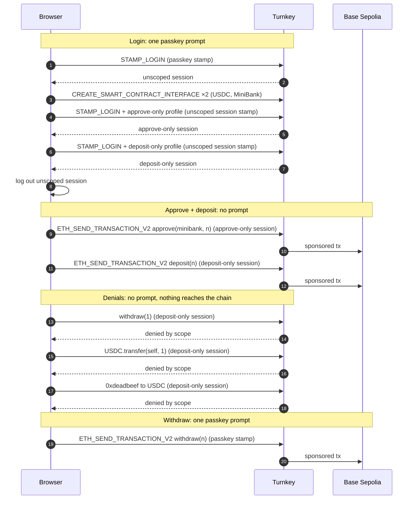

# Example: `with-scoped-deposit-session`

A browser session that can deposit USDC into a vault but is not scoped to withdraw or transfer it.

The question this answers: if a user's browser session is stolen, can the
attacker withdraw? With Turnkey [session profiles](https://docs.turnkey.com/features/authentication/sessions/session-profiles),
the answer is no. The session's scope is evaluated in the enclave on every
request, before any policy, and it can only restrict. Deposits go through
the session with no prompt. Withdrawals are not policy-scoped so any withdrawal
will require the passkey.

The vault is a small demo contract, [MiniBank](https://sepolia.basescan.org/address/0xcAdD4bb1Cfcd76C25f3702AD698679CbD934d12E), deployed once on Base Sepolia.
Every transaction in this example is a [sponsored EVM transaction](https://docs.turnkey.com/features/transaction-management/sending-sponsored-transactions), so the user's wallet never
holds ETH.

## What it shows

1. **One passkey prompt, two scoped sessions.** A passkey login returns an
   unscoped session. The app uses it to mint one scoped session per profile
   with `STAMP_LOGIN`, stores both, and logs the unscoped one out.
2. **The profile is a ceiling.** The app requests a 24-hour session; each
   profile caps it at 15 minutes; the JWT shows what was actually issued.
3. **Deposit with no prompt.** One button sends `approve(minibank, amount)`
   on the `approve-only` session and `deposit(amount)` on the `deposit-only`
   session. Switching sessions is a local choice of which key stamps the requests.
4. **Denials, asserted.** Three out-of-scope calls are sent on the
   deposit-only session: `withdraw`, a USDC `transfer`, and calldata that
   matches nothing in the ABI. Each must come back denied. A transaction hash
   on any of them is reported as a failure.
5. **Withdraw with the passkey.** Same wallet, same contract, different
   credential. With one prompt the USDC is withdrawn back to the user's wallet.

## The scopes

Two session profiles, one action each, both with a 900-second cap. They use
the same language as policy conditions, with `function_name` and
`contract_call_args` decoded from ABIs uploaded as
[smart contract interfaces](https://docs.turnkey.com/features/policies/smart-contract-interfaces).

`approve-only`:

```
activity.kind == 'ETH_SEND_TRANSACTION'
  && eth.tx.to == '<usdc>'
  && eth.tx.function_name == 'approve'
  && eth.tx.contract_call_args['spender'] == '<minibank>'
```

`deposit-only`:

```
activity.kind == 'ETH_SEND_TRANSACTION'
  && eth.tx.to == '<minibank>'
  && eth.tx.function_name == 'deposit'
```

### Why two profiles and not one with `||`

The policy engine evaluates every clause of a scope on every request; it
does not short circuit (see the Appendix of the
[policy language](https://docs.turnkey.com/features/policies/language#policy-evaluation)
docs). In a combined scope, the approve clause's
`contract_call_args['spender']` would be evaluated on a `deposit` call, which
has no `spender` argument, and the evaluation fails rather than being false.
A combined scope can therefore never allow the deposit. One profile per
action keeps every clause evaluable on the one call its session sends, which
is the same reason regular policies are written one per action. The client
holds a session per profile and composes them.

The cost is two transactions instead of one atomic batch. A failure after the
approve leaves an allowance behind, which is harmless here.

### Where the ABIs live

`function_name` and `contract_call_args` are only decoded when the
organization evaluating the transaction has an interface for `eth.tx.to`.
That is the sub-organization, not the parent. The parent's interfaces are
never consulted for a sub-organization's transaction, so the app uploads the
two ABIs into each new sub-organization at sign-up, on the unscoped session.
Without them every clause is false and even a deposit is denied.

## How it works



Scope denials arrive as `Turnkey error 7` with the detail
`No policies evaluated to outcome: Allow`. The message talks about policies
even when the session scope is what said no.

## Getting started

### 1/ Clone and build

Make sure you have Node.js installed locally; we recommend Node v20+.

```bash
$ git clone https://github.com/tkhq/sdk
$ cd sdk/
$ corepack enable  # Install `pnpm`
$ pnpm install -r  # Install dependencies
$ pnpm run build-all  # Compile source code
$ cd examples/access-control/with-scoped-deposit-session/
```

The build step matters. The example links the workspace packages, so it
runs whatever is in their `dist/` folders.

### 2/ Set up Turnkey

You need:

- A [Turnkey organization](https://app.turnkey.com/) with
  [gas sponsorship](https://docs.turnkey.com/features/transaction-management/broadcasting)
  enabled. Sub-organizations inherit the parent's sponsorship.
- An [Auth Proxy](https://docs.turnkey.com/authentication/auth-proxy) config
  with passkeys enabled. Sign-up creates a sub-organization with the passkey
  as its root user and one Ethereum account.
- An API key pair for a user in the parent organization, used only by the
  setup script to create the two session profiles.
- A browser with passkey support, on `localhost` or HTTPS.

### 3/ Configure `.env.local`

Create `.env.local` in this directory:

```bash
# Used by the setup script (server side)
API_PUBLIC_KEY="<parent org API public key>"
API_PRIVATE_KEY="<parent org API private key>"
BASE_URL="https://api.turnkey.com"
ORGANIZATION_ID="<parent organization id>"

# Used by the app (browser)
NEXT_PUBLIC_ORGANIZATION_ID="<parent organization id>"
NEXT_PUBLIC_AUTH_PROXY_CONFIG_ID="<auth proxy config id>"
NEXT_PUBLIC_SESSION_PROFILE_ID_APPROVE_ONLY=""   # filled in the next step
NEXT_PUBLIC_SESSION_PROFILE_ID_DEPOSIT_ONLY=""   # filled in the next step

# Optional overrides
# NEXT_PUBLIC_BASE_URL="https://api.turnkey.com"
# NEXT_PUBLIC_AUTH_PROXY_BASE_URL="https://authproxy.turnkey.com"
# NEXT_PUBLIC_USDC_ADDRESS="0x036CbD53842c5426634e7929541eC2318f3dCF7e"
# NEXT_PUBLIC_MINIBANK_ADDRESS="0xcAdD4bb1Cfcd76C25f3702AD698679CbD934d12E"
```

### 4/ Create the session profiles

```bash
$ pnpm create-profile
```

This creates `approve-only` and `deposit-only` on the parent organization
and prints the two `NEXT_PUBLIC_SESSION_PROFILE_ID_*` lines to paste into
`.env.local`. It is idempotent: a profile whose name and scope already match
is reused. If the parent's root quorum is above 1, each creation waits in
`CONSENSUS_NEEDED` until another root user approves it in the dashboard; the
script prints the activity id and polls until it completes.

Session profiles are immutable. To change a scope, change the variant's
name in `src/lib/config.ts` and run the script again.

### 5/ Run it

```bash
$ pnpm dev
```

Open [http://localhost:3000](http://localhost:3000).

## Walkthrough

1. **Sign up with a passkey.** One prompt. The card that appears shows the
   JWT's `session_type`, `session_profile_id` and scope, and a countdown that
   starts near 15:00 even though the login asked for 24 hours. A switcher at
   the top flips between the two scoped sessions with no prompt.
2. **Fund the depositor.** Copy the wallet address and request Base Sepolia
   USDC from [faucet.circle.com](https://faucet.circle.com). Refresh the
   balances.
3. **Approve + deposit.** No prompt. Two transaction links appear, the
   wallet balance drops and the MiniBank balance rises. Press it again with
   an amount inside the existing allowance and only the deposit goes out.
4. **Send all three with the deposit-only session.** Three green ticks, each
   with Turnkey's denial line. Nothing moved.
5. **Withdraw (passkey).** One prompt. The MiniBank balance drops and the
   wallet balance rises.

To start over with a fresh sub-organization, log out and sign up again with a
new passkey. Returning users log in with their existing passkey and get both
scoped sessions minted again from one prompt.

## Files

```
src/lib/config.ts        addresses, ABIs, the two scopes, profile env wiring
src/lib/minibank.ts      balance reads and calldata builders (viem)
src/scripts/setup.ts     creates the session profiles on the parent org
src/app/Demo.tsx         the flow: login, mint sessions, deposit, denials, withdraw
src/app/providers.tsx    TurnkeyProvider with the Auth Proxy config
src/app/ui.tsx           small UI kit and error formatting
```

## MiniBank

A deliberately minimal vault holding one ERC-20: `deposit(uint256)`,
`withdraw(uint256)`, `balanceOf(address)`, `TOKEN()`. Deployed on Base
Sepolia at
[`0xcAdD4bb1Cfcd76C25f3702AD698679CbD934d12E`](https://sepolia.basescan.org/address/0xcAdD4bb1Cfcd76C25f3702AD698679CbD934d12E)
against Circle's Base Sepolia USDC, source verified on
[Sourcify](https://sourcify.dev/#/lookup/0xcAdD4bb1Cfcd76C25f3702AD698679CbD934d12E).
The deployment itself was a sponsored transaction: contract creation has no
`to`, which Gas Station requires, so it went through the CREATE2 deployment
proxy at `0x4e59b44847b379578588920cA78FbF26c0B4956C`, which turns a deploy
into an ordinary call. You can point the example at your own instance with
`NEXT_PUBLIC_MINIBANK_ADDRESS`.

## Notes

- **The unscoped session exists for a few seconds.** Between the passkey
  login and the logout after minting, the browser holds a fully privileged
  session. The app uses it only to upload interfaces and mint scoped
  sessions, then drops it, and it requests a 60-second expiry for it rather
  than the SDK's 15-minute default so the window stays short even if that
  logout failed. Do the same in your own code.
- **Switching sessions.** Each scoped session is its own key pair and JWT.
  In `@turnkey/core` the switch is `setActiveSession`. This example re-stores
  the chosen token with `storeSession` instead, which also refreshes the
  provider's React state; see the comment on `activate` in `Demo.tsx`.
- **Two SDK behaviours shape the minting order.** `storeSession` makes the
  stored session active, so the unscoped session is re-activated before each
  mint; and it deletes any key pair not referenced by a stored session, so
  each key is created, used and stored before the next is created.
- **Expired sessions.** Both scoped sessions expire after 15 minutes. Log in
  again to mint fresh ones.
- **Stale builds.** If a passkey-stamped call goes out with the session's
  `X-Stamp` header instead of `X-Stamp-Webauthn`, or behaviour does not match
  the source, rebuild the packages (`pnpm run build-all`) and clear `.next`.
