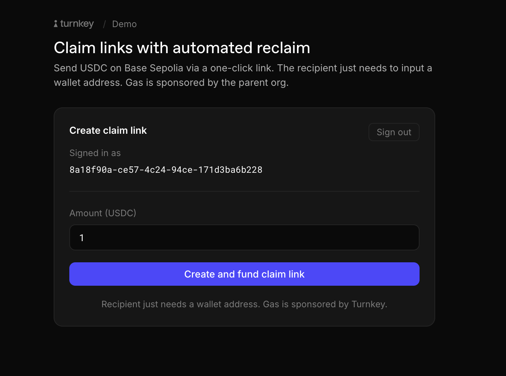
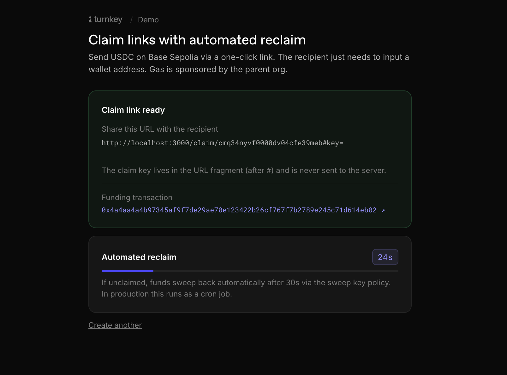
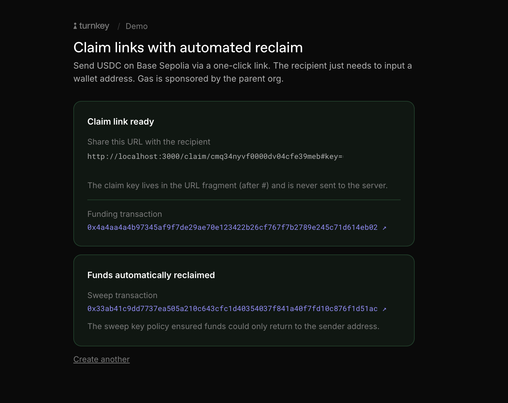

# Example: `claim-links-delegated-reclaim`

A Next.js demo showing USDC claim links with automated reclaim on Base Sepolia.

## Flows

**1. Create a claim link**

<p align="center"></p>

Sender signs in and funds a claim link. The escrow is funded server-side via a sponsored transaction.

---

**2. Claim link ready - automated reclaim countdown**

<p align="center"></p>

The claim URL is shown alongside a countdown. TTL is set to 30s here to showcase the automated reclaim - in production this would be hours or days. When it expires, the sweep key policy returns funds to the sender automatically. In production a cron job replaces the local `setTimeout`.

---

**3. Funds automatically reclaimed**

<p align="center"></p>

Once the TTL expires unclaimed, funds are swept back to the sender via the sweep key policy. The policy enforces that funds can only ever return to the original sender address.

---

All transactions are gas-sponsored by the parent org.

## How it works

Each claim link gets its own Turnkey sub-org with two root users:

- **Claim key** - P256 API key embedded in the URL fragment (`#key=...`). Has a TTL; the recipient uses it to retrieve the funds.
- **Sweep key** - generated server-side, encrypted at rest. Locked by policy to only transfer funds back to the sender. Used for automated reclaim.

This follows the [Delegated Access](https://docs.turnkey.com/features/policies/delegated-access/overview) pattern - a business-controlled key with carefully scoped permissions operating inside an end-user sub-org.

**Bootstrap order** (see `src/server/turnkey/bootstrap.ts`):

1. Create sub-org with both keys as root users
2. Sweep key (still root) installs a sender-locked transfer policy on itself
3. Sweep key demotes itself - policy is now its only permission

This order is critical. Policy creation requires root access; demotion must happen after.

## Getting started

### 1/ Cloning the example

Make sure you have `Node.js` installed locally; we recommend using Node v18+.

```bash
$ git clone https://github.com/tkhq/sdk
$ cd sdk/
$ corepack enable  # Install `pnpm`
$ pnpm install -r  # Install dependencies
$ pnpm run build-all  # Compile source code
$ cd examples/claim-links-delegated-reclaim/
```

### 2/ Setting up Turnkey

The first step is to set up your Turnkey organization and account. By following the [Quickstart](https://docs.turnkey.com/getting-started/quickstart) guide, you should have:

- A public/private API key pair for Turnkey
- An organization ID
- A Turnkey wallet account address (this becomes `SIGN_WITH`)

Once you've gathered these values, add them to a new `.env.local` file. Notice that your private key should be securely managed and **never** be committed to git.

```bash
$ cp .env.local.example .env.local
```

Then fill in the values in `.env.local` (see [Environment variables](#environment-variables) below).

### 3/ Setting up the database

```bash
$ pnpm db:generate
$ pnpm db:migrate --name init
```

### 4/ Running the app

```bash
$ pnpm dev
```

Open [http://localhost:3000](http://localhost:3000).

## Environment variables

| Variable                           | Purpose                                                      |
| ---------------------------------- | ------------------------------------------------------------ |
| `NEXT_PUBLIC_TURNKEY_ORG_ID`       | Parent org UUID                                              |
| `NEXT_PUBLIC_BASE_URL`             | Base URL for claim link generation                           |
| `API_PUBLIC_KEY`                   | Parent org public API key                                    |
| `API_PRIVATE_KEY`                  | Parent org private API key                                   |
| `SIGN_WITH`                        | Company wallet address - funds escrows and receives reclaims |
| `TURNKEY_BASE_URL`                 | Turnkey API base, default `https://api.turnkey.com`          |
| `NEXT_PUBLIC_AUTH_PROXY_CONFIG_ID` | Auth Proxy config for email OTP / Google OAuth               |
| `NEXT_PUBLIC_GOOGLE_CLIENT_ID`     | Optional - enables Google sign-in                            |
| `NEXT_PUBLIC_EVM_CHAIN`            | CAIP2 chain ID, default `eip155:84532` (Base Sepolia)        |
| `NEXT_PUBLIC_USDC_CONTRACT`        | USDC contract on the target chain                            |
| `ENCRYPTION_KEY`                   | 32-byte hex key for sweep key encryption at rest             |
| `DATABASE_URL`                     | SQLite path, default `file:./dev.db`                         |

Generate `ENCRYPTION_KEY`:

```bash
node -e "console.log(require('crypto').randomBytes(32).toString('hex'))"
```

## Note on funding

This demo uses a single operator wallet (`SIGN_WITH`) to fund all claim links. In a real peer-to-peer flow, each sender would fund from their own Turnkey sub-org wallet and the sweep policy would return funds to that wallet if unclaimed. This requires the auth proxy to be configured to create user sub-orgs with an HD wallet.

## Automated reclaim

Locally the reclaim fires automatically via `setTimeout` after the TTL expires.

In production, replace with a scheduled cron job calling `POST /api/cron/reclaim`.
