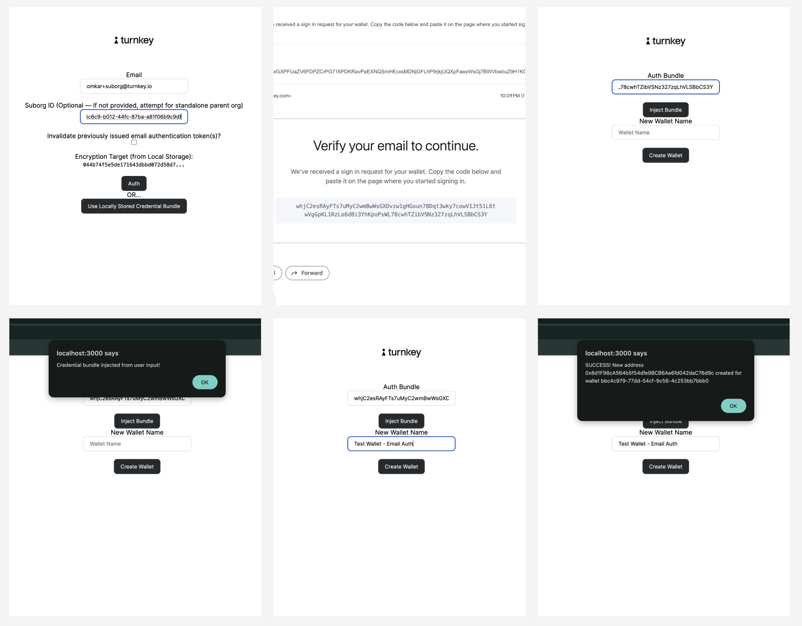

# Example: `email-auth-local-storage`

This example shows a complete email auth flow using a locally stored target embedded key. It contains a NextJS app with:

- a frontend application
- a backend application

The overall flow for email auth is outlined below:
. For more information on email auth, [check out our documentation](https://docs.turnkey.com/features/email-auth).

This example contains an auth page as well and enables you to create wallets using an email auth credential. Unlike our other [email auth example](https://github.com/tkhq/sdk/tree/main/examples/email-auth), this does not use an iframe, which typically houses a target embedded key. Instead, a target embedded key is created within the application itself and stored in local storage.

<p style="text-align:center">
    
</p>

You can try this example quickly on Stackblitz. Follow the instructions below --> [Stackblitz Instructions](#4-stackblitz-example)

## Getting started

### 1/ Cloning the example

Make sure you have `node` installed locally; we recommend using Node v18+.

```bash
$ git clone https://github.com/tkhq/sdk
$ cd sdk/
$ corepack enable  # Install `pnpm`
$ pnpm install -r  # Install dependencies
$ pnpm run build-all  # Compile source code
$ cd examples/email-auth-local-storage/
```

### 2/ Setting up Turnkey

The first step is to set up your Turnkey organization and account. By following the [Quickstart](https://docs.turnkey.com/getting-started/quickstart) guide, you should have:

- A public/private API key pair for Turnkey
- An organization ID

Once you've gathered these values, add them to a new `.env.local` file. Notice that your API private key should be securely managed and **_never_** be committed to git.

```bash
$ cp .env.local.example .env.local
```

Now open `.env.local` and add the missing environment variables:

- `API_PUBLIC_KEY`
- `API_PRIVATE_KEY`
- `NEXT_PUBLIC_ORGANIZATION_ID`
- `NEXT_PUBLIC_BASE_URL` (the `NEXT_PUBLIC` prefix makes the env variable accessible to the frontend app)

If you would like to test this with a standalone, parent organization, you will have to enable your parent organization to perform email auth. You can set the feature flag with the following via [tkcli](https://github.com/tkhq/tkcli):

```bash
turnkey request --host api.turnkey.com --path /public/v1/submit/set_organization_feature --body '{
    "timestampMs": "'"$(date +%s)"'000",
    "type": "ACTIVITY_TYPE_SET_ORGANIZATION_FEATURE",
    "organizationId": "<your organization ID>",
    "parameters": {
            "name": "FEATURE_NAME_EMAIL_AUTH"
    }
}' --organization <your organization ID>
```

### 3/ Running the app

```bash
$ pnpm run dev
```

This command will run a NextJS app on port 3000. If you navigate to http://localhost:3000 in your browser, you can follow the prompts to start an email auth.

### 4/ Stackblitz Example

Example Link: https://stackblitz.com/edit/stackblitz-starters-pyyw59

#### Prerequisites

To use the example you need the following

- Turnkey Organization
- API key for the root user (both public and private key needed)
- Turnkey Suborg with an email user

#### Set Env Variables

Set the following environment variables in the `.env.local` file

- `API_PUBLIC_KEY` --> Set this to be the public key of the API key for the root user for the org you've created
- `API_PRIVATE_KEY` --> Set this to be the private key of the API key for the root user for the org you've created
- `NEXT_PUBLIC_ORGANIZATION_ID` --> Set this to be the Org ID of the org you've created
- `NEXT_PUBLIC_BASE_URL` --> This will be preset with https://api.turnkey.com

#### Directions to use

- run `npm install && npm run dev`
