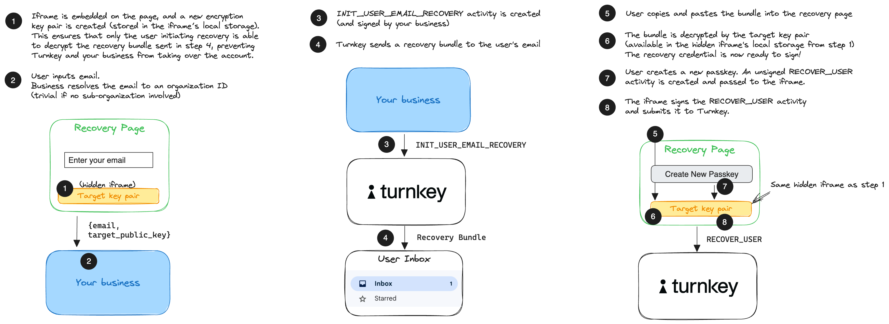
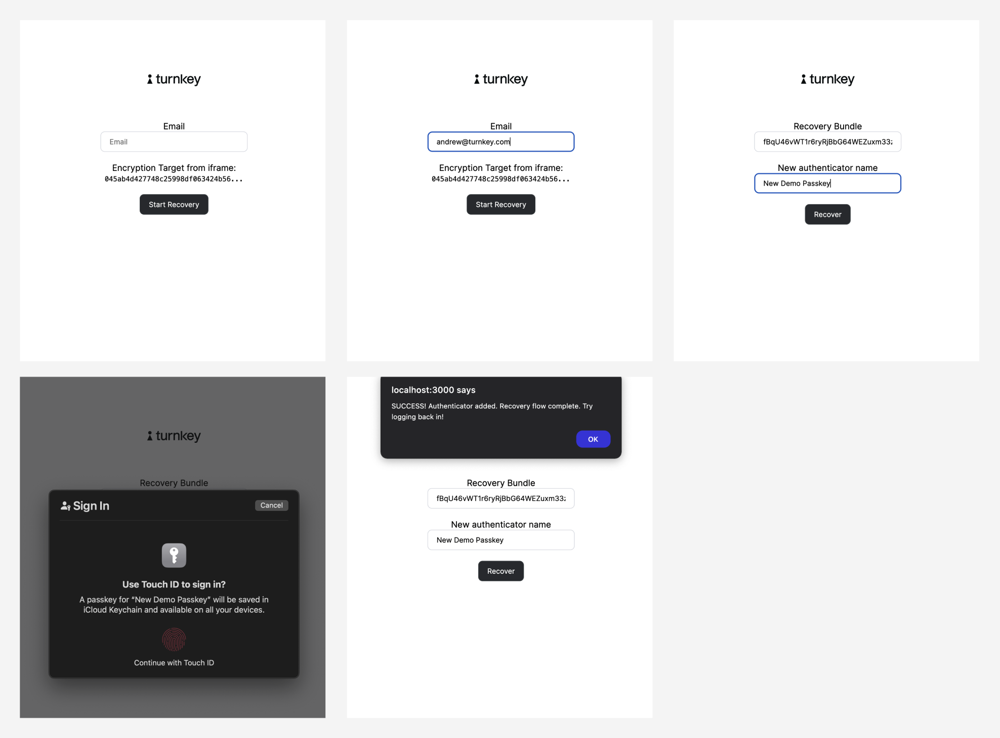

# Example: `email-recovery`

This example shows a complete email recovery flow. It contains a NextJS app with:

- a frontend application
- a backend application

The overall flow for email recovery is outlined below:


This example contains an example recovery page as well as a stub API endpoint for "your business" (where the email is resolved into an organization ID). The creation of the hidden iframe is abstracted by our `@turnkey/iframe-stamper` package. For more information on email recovery, [check out our documentation](https://docs.turnkey.com/features/email-recovery).

Note [10/3/2024]: we've since updated this example to use `@turnkey/sdk-react`, `@turnkey/sdk-server`, and `@turnkey/sdk-browser` to make it increasingly easier to interact with Turnkey, and especially iframes.



## Getting started

### 1/ Cloning the example

Make sure you have `node` installed locally; we recommend using Node v18+.

```bash
$ git clone https://github.com/tkhq/sdk
$ cd sdk/
$ corepack enable  # Install `pnpm`
$ pnpm install -r  # Install dependencies
$ pnpm run build-all  # Compile source code
$ cd examples/email-recovery/
```

### 2/ Setting up Turnkey

The first step is to set up your Turnkey organization and account. By following the [Quickstart](https://docs.turnkey.com/getting-started/quickstart) guide, you should have:

- A public/private API key pair for Turnkey
- An organization ID

Once you've gathered these values, add them to a new `.env.local` file. Notice that your API private key should be securely managed and **_never_** be committed to git.

```bash
$ cp .env.local.example .env.local
```

Now open `.env.local` and add the missing environment variables:

- `API_PUBLIC_KEY`
- `API_PRIVATE_KEY`
- `NEXT_PUBLIC_ORGANIZATION_ID`
- `NEXT_PUBLIC_BASE_URL` (the `NEXT_PUBLIC` prefix makes the env variable accessible to the frontend app)
- `NEXT_PUBLIC_RECOVERY_IFRAME_URL`

### 3/ Running the app

```bash
$ pnpm run dev
```

This command will run a NextJS app on port 3000. If you navigate to http://localhost:3000 in your browser, you can follow the prompts to start an email recovery.
