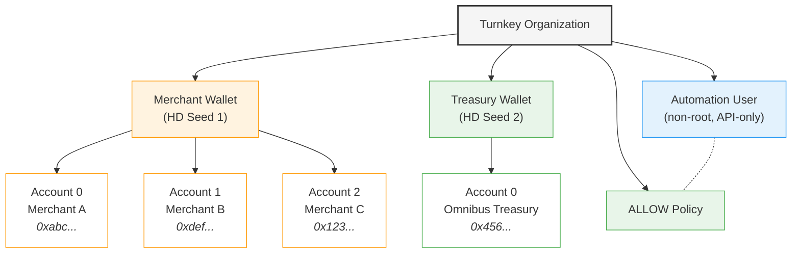
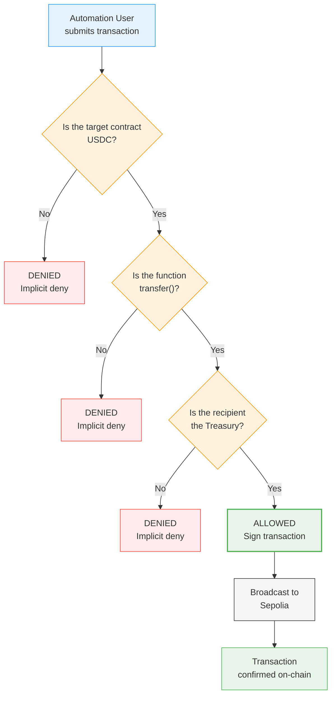

# Payflow — Customer Readout

**Prepared for:** Payflow CTO
**Date:** May 2026
**Subject:** Turnkey PoC for Stablecoin Payment Rails

---

## Problem Summary

Payflow is building stablecoin payment rails for small businesses. Merchants receive hundreds of USDC deposits daily from their customers, and Payflow needs to:

1. **Generate a dedicated deposit address for each merchant** on demand, without operational overhead.
2. **Sweep incoming USDC deposits into a single omnibus treasury** for accounting and liquidity management.
3. **Enforce strict fund controls** — only USDC can be moved, only to the treasury, and all other outbound transactions must be blocked — even if an API key is compromised.

Manual key management and ad-hoc transfer scripts don't meet Payflow's security or scalability requirements. They need infrastructure-grade key management with built-in policy controls.

---

## Solution Overview

Turnkey provides the key management, signing, and policy enforcement layer. The PoC demonstrates the full merchant flow using Turnkey's SDK and policy engine.

### 1. Setup: Organization Hierarchy

What `pnpm run-setup` provisions inside the Turnkey org:

**Key points:**
- **Wallet Accounts, not Wallets** — one HD seed, unlimited derived accounts. One merchant = one account. Scales to thousands without hitting the 100-wallet-per-org cap.
- **Separate treasury seed** — the highest-value address is isolated from merchant deposit keys.
- **Non-root automation user** — root credentials bypass the policy engine. Non-root ensures policies are actually enforced.

### 2. Demo: Sweep Transaction Flow

How the policy engine evaluates each transaction when `pnpm run-demo` runs a sweep:

Each demo scenario hits a different point in this flowchart:
- **Sweep to treasury** → passes all three checks → **ALLOWED**
- **USDC to attacker** → passes token check, passes function check, fails recipient check → **DENIED**
- **LINK to treasury** → fails token check immediately → **DENIED**

---

## Demo Walkthrough

The PoC runs as two CLI scripts:

### Setup (`pnpm run-setup`)
1. Creates a merchant HD wallet with 3 derived accounts (one per merchant)
2. Creates the treasury wallet with its omnibus account
3. Creates a non-root automation user with a generated API key pair
4. Creates the ALLOW policy that permits only USDC `transfer()` calls to the treasury

### Demo (`pnpm run-demo`)

The demo authenticates as the non-root automation user and presents an interactive CLI with five scenarios:

**Positive path — Sweep all merchants:**
- Scans all merchant accounts for USDC balances
- Sweeps every funded account to the treasury in one pass
- Signs each transaction through Turnkey's policy engine using `@turnkey/ethers`
- Broadcasts to Sepolia and waits for on-chain confirmation
- Prints the transaction hash and Etherscan link for each sweep

**Negative path 1 — Transfer to attacker blocked:**
- Builds a USDC transfer to a non-treasury address (simulating a compromised API key)
- Submits with the automation user's valid credentials
- The policy engine rejects the transaction — the recipient doesn't match the treasury
- The rejection reason is surfaced in the output

**Negative path 2 — Non-USDC token blocked:**
- Builds a transfer of a different ERC-20 (LINK) to the treasury address
- Submits with the automation user's credentials
- The policy engine rejects — the token contract doesn't match USDC
- The rejection reason is surfaced

The demo also includes balance refresh and a "run all" option that executes the positive sweep followed by both negative paths in sequence.

---

## Key Design Decisions

### Wallet Accounts vs. Wallets

A Turnkey **Wallet** is one HD seed, capped at 100 per organization. A **Wallet Account** is a derived address on that seed, and is unlimited. The PoC uses one Wallet with N derived accounts — one account per merchant. This means Payflow can scale to thousands of merchants without hitting the wallet cap.

### Separate Treasury Wallet

The treasury is the highest-value address in the system. It uses its own HD seed so that if the merchant wallet's seed were ever compromised, the treasury seed remains intact. One wallet slot out of 100 is a trivial cost for this isolation.

### Single Policy + Implicit Deny

One ALLOW policy governs all merchant accounts at once. It checks three conditions:
1. `eth.tx.to` must be the USDC contract (token-level restriction)
2. `eth.tx.data[0..10]` must be the `transfer()` selector (function-level restriction — blocks `approve()` attacks)
3. `eth.tx.data[10..74]` must be the padded treasury address (recipient-level restriction)

Everything not matching this policy is rejected by Turnkey's implicit deny. No DENY policies are needed, and no per-merchant policy management is required.

### Signing Architecture

The PoC uses `@turnkey/ethers` (`TurnkeySigner`) to separate signing from broadcasting:
- **Signing** happens through Turnkey's policy engine — every transaction is evaluated against the ALLOW policy before the key material is used
- **Broadcasting** happens through a standard ethers.js JSON-RPC provider to Sepolia

This separation gives Payflow full control over the broadcast layer (retry logic, gas estimation, nonce management) while Turnkey handles the security-critical signing path.

### PoC vs. Production Architecture

This PoC uses a flat org structure for simplicity. **In production, we recommend sub-organizations per merchant:**

| Concern | PoC (Flat Org) | Production (Sub-Orgs) |
|---------|---------------|----------------------|
| Isolation | Shared seed across merchants | Each merchant has its own seed |
| Blast radius | Single-seed compromise affects all merchants | Compromise is contained to one merchant |
| Policy headroom | One policy covers all | Per-merchant policies with specific limits |
| Audit trails | Shared activity log | Per-merchant activity history |
| Offboarding | Cannot revoke one merchant's keys independently | Delete the sub-org |

The sub-org model is a deliberate scoping choice — the PoC validates the sweep mechanics and policy controls, while the production path adds the isolation layer.

---

## Operational Considerations

### Least-Privilege Automation

The automation user is non-root by design. A fresh non-root user starts with zero permissions (implicit deny). The only thing it can do is what the single ALLOW policy permits: USDC transfers to the treasury. It cannot create wallets, modify policies, or manage users.

### Single-Seed Risk in the Flat Model

In the PoC's flat structure, all merchant accounts derive from one seed. A compromised seed could expose all merchant deposit addresses. The production sub-org model eliminates this by giving each merchant its own HD seed within its own sub-organization.

### Key Rotation

The automation user's API key can be rotated without affecting wallet addresses or policies. Turnkey supports adding new API keys and revoking old ones on any user.

---

## Future Roadmap

1. **Sub-organizations per merchant** — production isolation, per-merchant policies, clean offboarding
2. **Automated sweep triggering** — replace manual CLI runs with indexer webhooks (e.g., Alchemy, QuickNode) or a polling worker that detects deposits and triggers sweeps automatically
3. **Value caps** — add per-transaction or daily limits to the policy condition to control maximum sweep amounts
4. **Multi-chain support** — extend to Polygon, Arbitrum, or Base for lower gas costs and faster finality
5. **Gas sponsorship** — use Turnkey's gas station feature to eliminate the need for merchants to hold ETH for gas
6. **Monitoring and alerting** — integrate with Turnkey's webhook endpoints for real-time sweep status notifications
