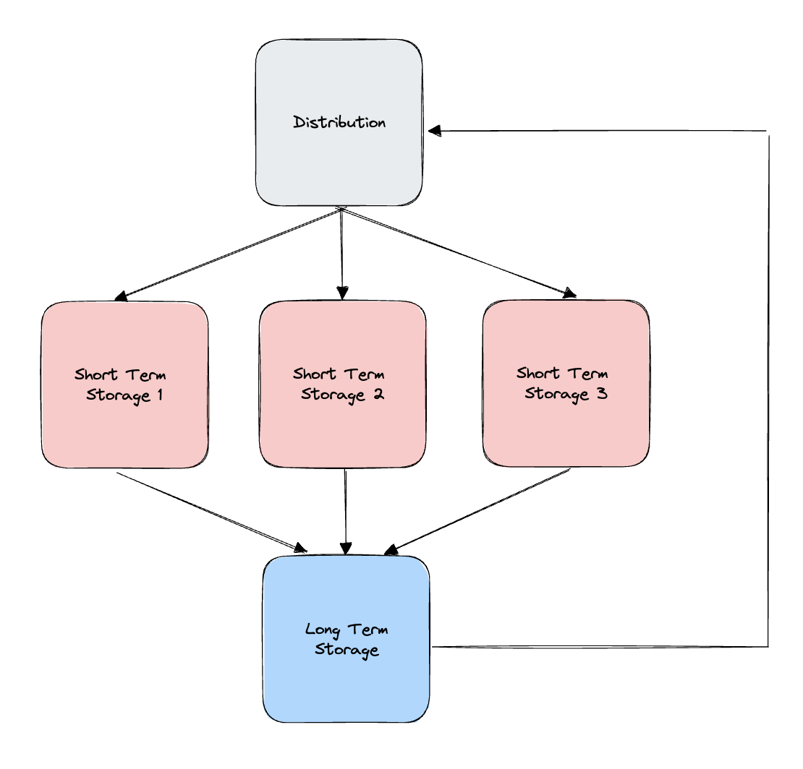

# Example: `rebalancer`

A demo application which showcases an example of how to use Turnkey for managing multiple types of keys & users.

**Note:** This example uses the Sepolia testnet!

## Scenario

This scenario focuses on a cyclical flow of cryptocurrency through three types of accounts: Distribution, Short Term Storage, and Long Term Storage.

**Distribution:** This is the primary account from where the funds are distributed from. It can be unilaterally controlled by a user with the "executor" tag.

**Short Term Storage:** These are a series of accounts that receive funds from the Distribution account. These can be unilaterally controlled by a user with the "management" tag.

**Long Term Storage:** This is an account that is intended to hold cryptocurrency for a longer period of time. As such, 2 "management" users must agree to move funds from this account.

ETH is transferred from the "Distribution" account to the "Short Term Storage" accounts using the `fund` command. Once a sufficient balance is met, ETH can be swept from the "Short Term Storage" accounts to the "Long Term Storage" account using the `sweep` command. And finally, funds can be transferred from the "Long Term Storage" account back to the "Distribution" account using the `recycle` command.

This process is outlined in the diagram below:



## Getting started

### 1/ Cloning the example

Make sure you have `Node.js` installed locally; we recommend using Node v18+.

```bash
$ git clone https://github.com/tkhq/sdk
$ cd sdk/
$ corepack enable  # Install `pnpm`
$ pnpm install -r  # Install dependencies
$ pnpm run build-all  # Compile source code
$ cd examples/rebalancer/
```

### 2/ Setting up Turnkey

The first step is to set up your Turnkey organization and account. By following the [Quickstart](https://docs.turnkey.com/getting-started/quickstart) guide, you should have:

- A public/private API key pair for Turnkey
- An organization ID

Once you've gathered these values, add them to a new `.env.local` file. Notice that your private key should be securely managed and **_never_** be committed to git.

```bash
$ cp .env.local.example .env.local
```

Now open `.env.local` and add the missing environment variables:

- `API_PUBLIC_KEY`
- `API_PRIVATE_KEY`
- `BASE_URL`
- `ORGANIZATION_ID`
- `INFURA_KEY` -- if this is not set, it will default to using the Community Infura key

### 3/ Setup

Create the organizational structure required for this demo:

```
// setup an organization with users, private keys, and policies
pnpm cli setup
```

### 4/ Pre-Fund

Before executing any txns using Turnkey, you'll first need the "Distribution" address to have some funds. In the Turnkey dashboard, look up the address for "Distribution" and then send some funds to it from an external wallet or directly from a [faucet](https://sepoliafaucet.com/).

### 5/ Fund

Once the "Distribution" address has funds in it, execute the "fund" command to transfer funds from "Distribution" to the "Short Term Storage" addresses.

```
pnpm cli fund
```

Alternatively, this command can be continuously executed using the `--interval` flag:

```
pnpm cli fund --interval=20000
```

### 6/ Sweep

Next, use the "sweep" command to move the assets from the "Short Term Storage" addresses to the "Long Term Storage" address.

```
pnpm cli sweep --key=phil
```

Similar to "fund", this can be executed on an interval:

```
pnpm cli sweep --key=phil --interval=20000
```

Note that we're using "Phil" to execute this transaction. Recall from the setup, that Phil is tagged as an "executor". Phil is able to unilaterally move funds from a "Short Term Storage" address.

### 6/ Initiate Recycle

Lastly, use the "recycle" command to move the funds stored in the "Long Term Storage" address back to "Distribution".

```
pnpm cli recycle --key=bob
```

We're using "Bob", who is tagged as a "manager", to execucute this transaction. The policy associated with the "Long Term Storage" address ensures that a "manager" can initiate a transaction from "Long Term Storage" but it must be approved by another "manager" or "admin" in order to actually be signed by Turnkey.

If successful, you'll receive a message like:

```
Consensus is required for activity <ID> in order to send <VALUE> ETH to <ADDRESS>. Please visit the dashboard.
```

Save the activity ID in this response. You'll use it when approving the txn

### 7/ Poll & Broadcast

Next, run the "pollAndBroadcast" command to wait for the tx to be confirmed and broadcast once it is.

```
pnpm cli pollAndBroadcast --interval=20000
```

### 8/ Approve Recycle

Finally, approve the recycle txn using the activity ID from above:

```
pnpm cli approveActivity --key=alice --id=<ID>
```

Once approved, you should see the "pollAndBroadcast" command detect the approved txn and broadcast it to the Sepolia testnet.
