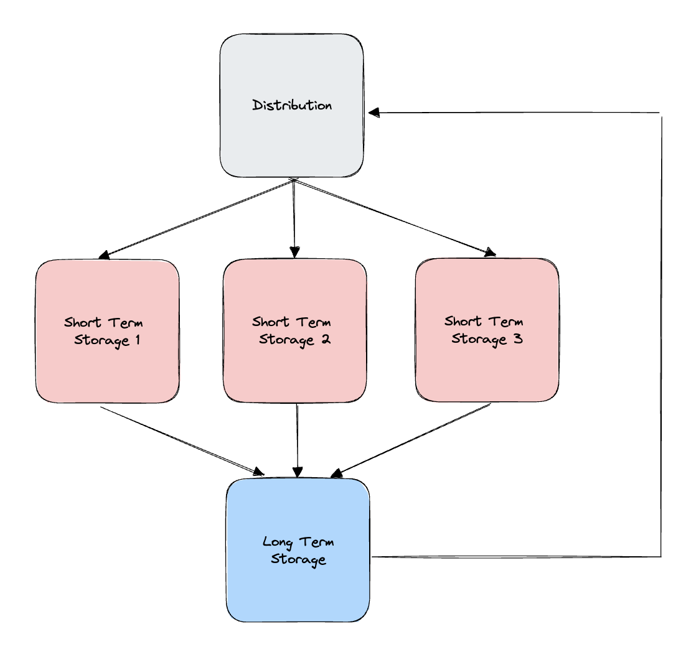

# Example: `rebalancer`

A demo application which showcases an example of how to use Turnkey for managing multiple types of keys & users.

This demo uses Turnkey's Gas Sponsorship feature. Learn more about sending sponsored transactions in the [Transaction Management docs](https://docs.turnkey.com/company-wallets/code-examples/sending-sponsored-transactions).

> **Note:** This example uses the Sepolia testnet!

## Scenario

This scenario focuses on a cyclical flow of cryptocurrency through three types of accounts: Distribution, Short Term Storage, and Long Term Storage.

**Distribution:** This is the primary account from where the funds are distributed from. It can be unilaterally controlled by a user with the "executor" tag.

**Short Term Storage:** These are a series of accounts that receive funds from the Distribution account. These can be unilaterally controlled by a user with the "management" tag.

**Long Term Storage:** This is an account that is intended to hold cryptocurrency for a longer period of time. As such, 2 "management" users must agree to move funds from this account.

ETH is transferred from the "Distribution" account to the "Short Term Storage" accounts using the `fund` command. Once a sufficient balance is met, ETH can be swept from the "Short Term Storage" accounts to the "Long Term Storage" account using the `sweep` command. And finally, funds can be transferred from the "Long Term Storage" account back to the "Distribution" account using the `recycle` command.

This process is outlined in the diagram below:



## Getting started

### 1/ Cloning the example

Make sure you have `Node.js` installed locally; we recommend using Node v18+.

```bash
$ git clone https://github.com/tkhq/sdk
$ cd sdk/
$ corepack enable  # Install `pnpm`
$ pnpm install -r  # Install dependencies
$ pnpm run build-all  # Compile source code
$ cd examples/rebalancer/
```

### 2/ Setting up Turnkey

The first step is to set up your Turnkey organization and account. By following the [Quickstart](https://docs.turnkey.com/getting-started/quickstart) guide, you should have:

- A public/private API key pair for Turnkey
- An organization ID

Once you've gathered these values, add them to a new `.env.local` file. Notice that your private key should be securely managed and **_never_** be committed to git.

```bash
$ cp .env.local.example .env.local
```

Now open `.env.local` and add the missing environment variables:

- `API_PUBLIC_KEY`
- `API_PRIVATE_KEY`
- `BASE_URL`
- `ORGANIZATION_ID`
- `RPC_URL` -- The RPC URL from your RPC provider
- `USE_GAS_SPONSORSHIP` -- set this to `true` to send sponsored transactions

### 3/ Setup

Create the organizational structure required for this demo:

```
// setup an organization with users, private keys, and policies
pnpm cli setup
```

The `setup` command will output:

```
New user tag created!
- Name: Admin
- User tag ID: <ADMIN-USER-TAG-ID>

New user tag created!
- Name: Manager
- User tag ID: <MANAGER-USER-TAG-ID>

New user tag created!
- Name: Executor
- User tag ID: <EXECUTOR-USER-TAG-ID>

New user created!
- Name: Alice
- User ID: <ALICE-USER-ID>

New user created!
- Name: Bob
- User ID: <BOB-USER-ID>

New user created!
- Name: Phil
- User ID: <PHIL-USER-ID>

New private key tag created!
- Name: distribution
- Private key tag ID: <DISTRIBUTION-PRIVATE-KEY-TAG-ID>

New private key tag created!
- Name: short-term-storage
- Private key tag ID: <SHORT-TERM-STORAGE-PRIVATE-KEY-TAG-ID>

New private key tag created!
- Name: long-term-storage
- Private key tag ID: <LONG-TERM-STORAGE-PRIVATE-KEY-TAG-ID>

creating a new Ethereum private key on Turnkey...

New Ethereum private key created!
- Name: Distribution
- Private key ID: <DISTRIBUTION-PRIVATE-KEY-ID>
- Address: <DISTRIBUTION-WALLET-ADDRESS>

creating a new Ethereum private key on Turnkey...

New Ethereum private key created!
- Name: Long Term Storage
- Private key ID: <LONG-TERM-STORAGE-PRIVATE-KEY-ID>
- Address: <LONG-TERM-STORAGE-WALLET-ADDRESS>

creating a new Ethereum private key on Turnkey...

New Ethereum private key created!
- Name: Short Term Storage 1
- Private key ID: <SHORT-TERM-STORAGE-1-PRIVATE-KEY-ID>
- Address: <SHORT-TERM-STORAGE-1-WALLET-ADDRESS>

creating a new Ethereum private key on Turnkey...

New Ethereum private key created!
- Name: Short Term Storage 2
- Private key ID: <SHORT-TERM-STORAGE-2-PRIVATE-KEY-ID>
- Address: <SHORT-TERM-STORAGE-2-WALLET-ADDRESS>

creating a new Ethereum private key on Turnkey...

New Ethereum private key created!
- Name: Short Term Storage 3
- Private key ID: <SHORT-TERM-STORAGE-3-PRIVATE-KEY-ID>
- Address: <SHORT-TERM-STORAGE-3-WALLET-ADDRESS>

New policy created!
- Name: Admin users can do everything
- Policy ID: <ADMIN-POLICY-ID>
- Effect: EFFECT_ALLOW
- Consensus: approvers.any(user, user.tags.contains('<ADMIN-USER-TAG-ID>'))
- Condition: true

New policy created!
- Name: Two Manager or Admin users can use long term storage keys
- Policy ID: <TWO-MANAGER-OR-ADMIN-POLICY-ID>
- Effect: EFFECT_ALLOW
- Consensus: approvers.filter(user, user.tags.contains('<MANAGER-USER-TAG-ID>') || user.tags.contains('<ADMIN-USER-TAG-ID>')).count() >= 2
- Condition: private_key.tags.contains('<LONG-TERM-STORAGE-PRIVATE-KEY-TAG-ID>')

New policy created!
- Name: Executor users can use short term storage keys
- Policy ID: <EXECUTOR-POLICY-ID>
- Effect: EFFECT_ALLOW
- Consensus: approvers.any(user, user.tags.contains('<EXECUTOR-USER-TAG-ID>'))
- Condition: private_key.tags.contains('<SHORT-TERM-STORAGE-PRIVATE-KEY-TAG-ID>')
```

#### Users and their roles

| User      | User Tag   | Role                                                                                                                                                     |
| --------- | ---------- | -------------------------------------------------------------------------------------------------------------------------------------------------------- |
| **Alice** | `Admin`    | Can approve or reject any activity in the organization. Used in steps 8a/8b to approve or reject the recycle transaction.                                |
| **Bob**   | `Manager`  | Can initiate a transaction from the Long Term Storage key, but requires a second Manager or Admin to approve it. Used in step 7 to initiate the recycle. |
| **Phil**  | `Executor` | Can unilaterally sign transactions from Short Term Storage keys. Used in step 6 to sweep funds to Long Term Storage.                                     |

Each user is assigned a user tag at creation time.

The user tag is passed as the second argument to `createUser` and determines which policies apply to that user, see [`src/index.ts:107-127`](./src/index.ts).

```typescript
const adminTagId = await createUserTag(turnkeyClient, "Admin", []);

await createUser(
  turnkeyClient,
  "Alice",
  [adminTagId],
  "Alice key",
  keys!.alice!.publicKey!,
);
```

### 4/ Pre-Fund

Before executing any transactions using Turnkey, you'll first need the "Distribution" address to have some funds. In the Turnkey dashboard, look up the address for "Distribution" and then send some funds to it from an external wallet or directly from a [faucet](https://sepoliafaucet.com/).

### 5/ Fund

Once the "Distribution" address has funds in it, execute the `fund` command to transfer funds from "Distribution" to the "Short Term Storage" addresses.

```
pnpm cli fund
```

Alternatively, this command can be continuously executed using the `--interval` flag:

```
pnpm cli fund --interval=20000
```

The output for the `fund` command should look like this:

```
Address:
        <DISTRIBUTION-WALLET-ADDRESS>

Balance:
        <DISTRIBUTION-WALLET-BALANCE> Ether

<TRANSACTION-HASH>
Sent <VALUE> ETH to <SHORT-TERM-STORAGE-1-WALLET-ADDRESS>:
        https://sepolia.etherscan.io/tx/<TRANSACTION-HASH>
```

This output repeats once per short term storage wallet — three logs in total. In each log, `Address` is the distribution wallet (the sender) and the destination is the respective short term storage wallet.

### 6/ Sweep

Next, use the `sweep` command to move the assets from the "Short Term Storage" addresses to the "Long Term Storage" address.

```
pnpm cli sweep --key=phil
```

Similar to `fund`, this can be executed on an interval:

```
pnpm cli sweep --key=phil --interval=20000
```

The output for this command should look like this:

```
Address:
        <SHORT-TERM-STORAGE-1-WALLET-ADDRESS>

Balance:
        <SHORT-TERM-STORAGE-1-WALLET-BALANCE> Ether

<TRANSACTION-HASH>
Sent <VALUE> ETH to <LONG-TERM-STORAGE-WALLET-ADDRESS>:
        https://sepolia.etherscan.io/tx/<TRANSACTION-HASH>
```

This output repeats once per short term storage wallet — three logs in total. In each log, `Address` is the short term storage wallet (the sender) and the destination is the long term storage wallet.

Note that we're using "Phil" to execute this transaction. Recall from the setup, that Phil is tagged as an "executor". Phil is able to unilaterally move funds from a "Short Term Storage" address.

### 7/ Initiate Recycle

Lastly, use the `recycle` command to move the funds stored in the "Long Term Storage" address back to "Distribution".

```
pnpm cli recycle --key=bob
```

The output for this command should look like this:

```
Address:
        <LONG-TERM-STORAGE-WALLET-ADDRESS>

Balance:
        <LONG-TERM-STORAGE-WALLET-BALANCE> Ether

Consensus is required for activity <ACTIVITY-ID> in order to send <VALUE> ETH to <DISTRIBUTION-WALLET-ADDRESS>.
```

We're using "Bob", who is tagged as a "manager", to execute this transaction. The policy associated with the "Long Term Storage" address ensures that a "manager" can initiate a transaction from "Long Term Storage" but it must be approved by another "manager" or "admin" in order to actually be signed by Turnkey.

If consensus is needed, the output will include a message like:

```
Consensus is required for activity <ACTIVITY-ID> in order to send <VALUE> ETH to <DISTRIBUTION-WALLET-ADDRESS>.
```

Save the activity ID — you'll need it in the next step when approving the transaction.

### 8a/ Approve Recycle

Approve the recycle transaction using Alice's key and the activity ID from above:

```
pnpm cli approveActivity --key=alice --id=<ACTIVITY-ID>
```

This command will output:

```
✅ Approved activity!
- Activity ID: <ACTIVITY-ID>
```

> **Note:** You can can also approve the transaction from the [Turnkey dashboard](https://app.turnkey.com/dashboard/activities).

Once approved, the transaction will be automatically broadcast to the Sepolia testnet.

### 8b/ Reject Recycle (Alternative)

Instead of approving, a "manager" or "admin" can reject the recycle activity using the activity ID from step 7:

```
pnpm cli rejectActivity --key=alice --id=<ACTIVITY-ID>
```

This command will output:

```
❌ Rejected activity!
- Activity ID: <ACTIVITY-ID>
```

> **Note:** You can also reject the transaction from the [Turnkey dashboard](https://app.turnkey.com/dashboard/activities).
