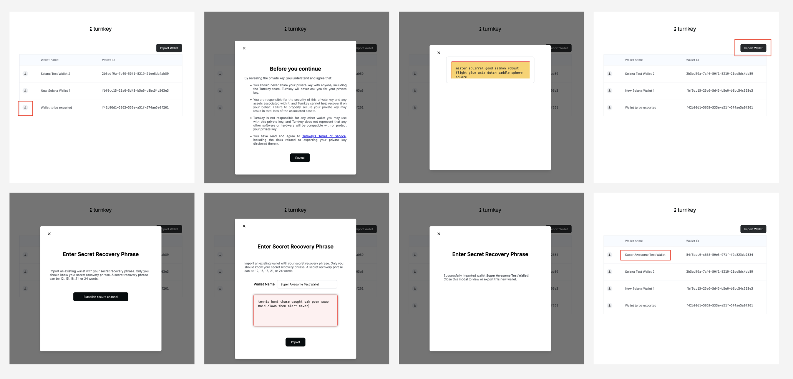

# Example: `wallet-import-export`

This example shows how to export wallets and wallet accounts, the latter of which can then be used for signing. It contains a NextJS app with:

- a frontend application
- a backend application

This example includes API stubs to make `whoami` requests and export wallets and wallet accounts. The creation of the iframe is abstracted by our `@turnkey/iframe-stamper` package.

<p style="text-align:center">
    
</p>

### DevEx Summary

1. Get iframe public key from export-and-sign iframe (located at export-and-sign.turnkey.com) via `iframeStamper.publicKey()` OR `await iframeStamper.getEmbeddedPublicKey()`. Generally, the latter is recommended. If it does not exist, you can initialize one via `await iframeStamper.initEmbeddedKey()`.
2. Use iframe public key in any `export` activity (e.g. `exportWalletAccount`).
3. Inject resulting bundle from (2) into the iframe via `await iframeStamper.injectKeyExportBundle()`. Note that the `address` param is optional, though recommended in case you would like multiple keys to live in the iframe at a time.

- Note that this step wipes out the iframe's embedded key (as we only want to use it to decrypt one export bundle at most). This means that for subsequent `export` activities, you will need to re-initialize the embedded key via `await iframeStamper.initEmbeddedKey()`.

4. Now, the iframe contains the key material you need to start performing signing. Note that this is stored strictly in-memory. Any page reload would wipe out this state, at which point we recommend starting from step (1).

## Getting started

### 1/ Cloning the example

Make sure you have `node` installed locally; we recommend using Node v18+.

```bash
$ git clone https://github.com/tkhq/sdk
$ cd sdk/
$ corepack enable  # Install `pnpm`
$ pnpm install -r  # Install dependencies
$ pnpm run build-all  # Compile source code
$ cd examples/wallet-import-export/
```

### 2/ Setting up Turnkey

The first step is to set up your Turnkey organization and account. By following the [Quickstart](https://docs.turnkey.com/getting-started/quickstart) guide, you should have:

- A public/private API key pair for Turnkey
- An organization ID

Once you've gathered these values, add them to a new `.env.local` file. Notice that your API private key should be securely managed and **_never_** be committed to git.

```bash
$ cp .env.local.example .env.local
```

Now open `.env.local` and add the missing environment variables:

- `API_PUBLIC_KEY`
- `API_PRIVATE_KEY`
- `NEXT_PUBLIC_ORGANIZATION_ID`
- `NEXT_PUBLIC_BASE_URL` (the `NEXT_PUBLIC` prefix makes the env variable accessible to the frontend app)
- `NEXT_PUBLIC_EXPORT_IFRAME_URL`
- `NEXT_PUBLIC_EXPORT_SIGN_FRAME_URL`

### 3/ Running the app

```bash
$ pnpm run dev
```

This command will run a NextJS app on port 3000. If you navigate to http://localhost:3000 in your browser, you can follow the prompts to export a wallet, and export + sign using a (Solana) wallet account.
