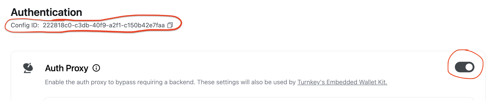

# Example: `with-0x`

This demo application demonstrates EVM swapping with Turnkey and 0x between ETH and USDC.

This example contains uses `@turnkey/react-wallet-kit` and `@turnkey/viem`, to handle authentication and signing with Turnkey wallets. To streamline authentication this example uses the Turnkey [Auth Proxy](https://docs.turnkey.com/reference/auth-proxy) to serve as the backend for authentication purposes. To obtain prices/quotes for the swap as well as building the swap transaction the server queries `0x`. This example also uses `viem` and `wagmi` to obtain wallet balances, set approvals on ERC-20 tokens; just USDC in this case, and broadcast transactions.

This example loosely follows this 0x guide: https://0x.org/docs/0x-swap-api/guides/swap-tokens-with-0x-swap-api.

Note: To utilize this example fund your Turnkey wallet with a reasonable amount of ETH, ~$5 USD, to cover gas fees and swap into USDC.

## Getting started

### 1/ Cloning the example

Make sure you have `node` installed locally; we recommend using Node v18+.

```bash
$ git clone https://github.com/tkhq/sdk
$ cd sdk/
$ corepack enable  # Install `pnpm`
$ pnpm install -r  # Install dependencies
$ pnpm run build-all  # Compile source code
$ cd examples/with-0x/
```

### 2/ Setting up Turnkey

The first step is to set up your Turnkey organization and account. By following the [Quickstart](https://docs.turnkey.com/getting-started/quickstart) guide, you should have:

- An organization ID

After you've set up your Turnkey account you need to enable [Auth Proxy](https://docs.turnkey.com/reference/auth-proxy). Visit [Wallet Kit](https://app.turnkey.com/dashboard/walletKit) and enable Auth Proxy. Configure any authentication methods you'd like, for this example, I've used passkeys and numeric 6-digit email OTP. Save your Auth Proxy config ID.

- Auth Proxy Config ID



Once you've gathered these values, add them to a new `.env.local` file. Notice that your API private key should be securely managed and **_never_** be committed to git.

```bash
$ cp .env.local.example .env.local
```

Now open `.env.local` and add the missing environment variables:

- `NEXT_PUBLIC_ORGANIZATION_ID` (the `NEXT_PUBLIC` prefix makes the env variable accessible to the frontend app)
- `NEXT_PUBLIC_AUTH_PROXY_CONFIG_ID`
- `NEXT_PUBLIC_API_BASE_URL`
- `NEXT_PUBLIC_AUTH_PROXY_BASE_URL`
- `ZEROX_API_KEY` (should not be prefixed with `NEXT_PUBLIC`)

### 3/ Setting up 0x

Navigate to https://dashboard.0x.org/ and sign-up/login and obtain your API key. Store your API key in the `ZEROX_API_KEY` environment variable in your `.env.local` file.

### 4/ Running the app

You should now have all of the environment variables in `.env.local` populated. You're now ready to run the application!

```bash
pnpm run dev
```
