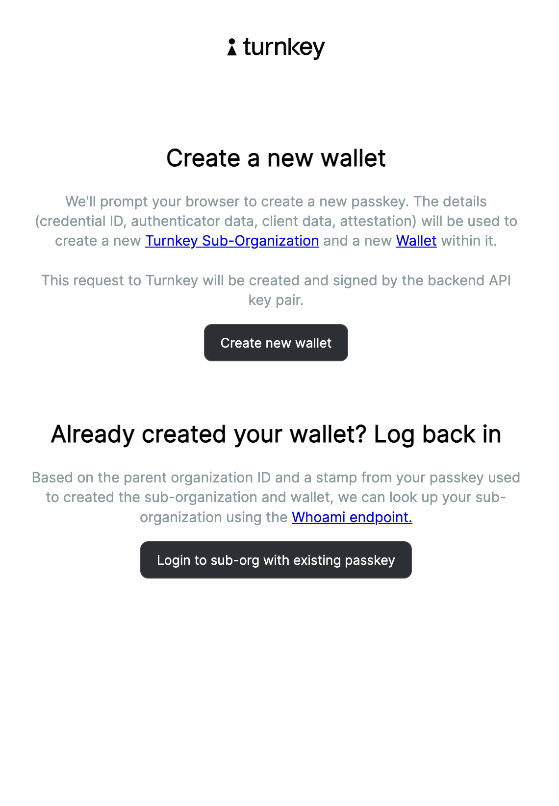
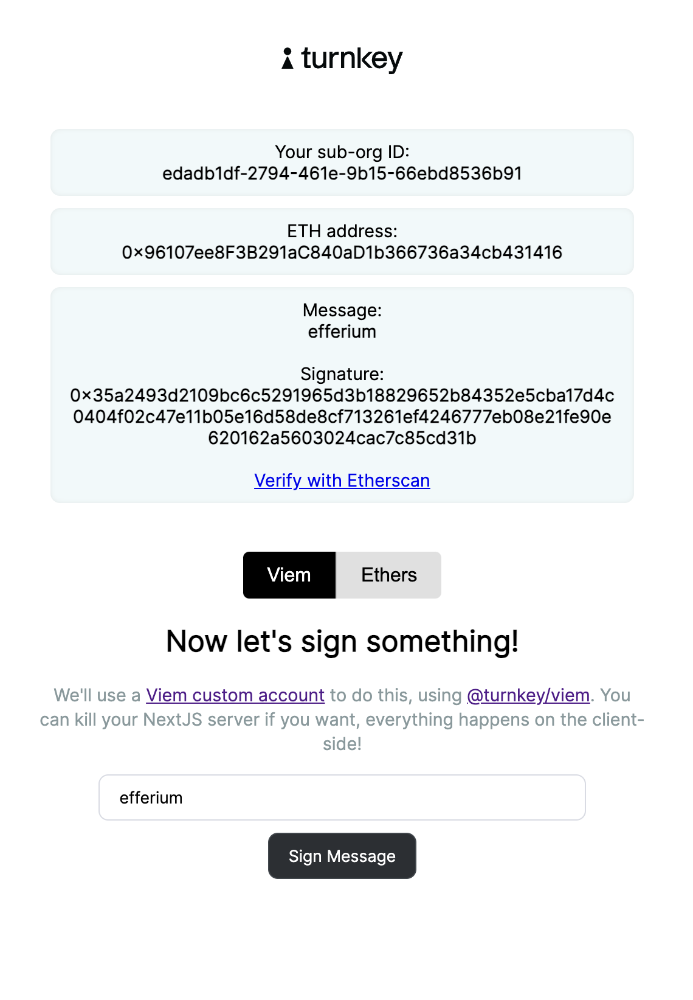

# Example: `with-eth-passkey-signers`

This repo contains a sample application **for demonstration purposes only**, walking through how to create sub-organizations, create wallets, and sign with the [`@turnkey/viem`](https://github.com/tkhq/sdk/tree/main/packages/viem) or [`@turnkey/ethers`](https://github.com/tkhq/sdk/tree/main/packages/ethers) signer, using passkeys. Please feel free play around and file an issue if there are improvements to be made! ❤️



The flow showcases 3 ways to make requests to Turnkey:

- the initial request to create a new [sub-organization](https://docs.turnkey.com/getting-started/sub-organizations) is authenticated in the NextJS backend with an API signature (using `API_PUBLIC_KEY`/`API_PRIVATE_KEY` from your `.env.local` file)
- the request to log back in is signed on the frontend with your passkey, but it's passed to the NextJS backend as a signed request (the body, stamp, and url are POSTed). This lets the backend submit this request on your behalf, get your sub-organization ID, and fetch details about your wallet (parent organizations have read-only access to their sub-organizations).
- the request to sign a message is done 100% client-side via a Turnkey Viem or Ethers signer (see [@turnkey/viem](https://github.com/tkhq/sdk/tree/main/packages/viem) and [@turnkey/ethers](https://github.com/tkhq/sdk/tree/main/packages/ethers), respectively): it's signed with your passkey, and submitted from the browser to the Turnkey API directly.

If you want to see a Viem or Ethers demo with API keys instead of passkeys, see these examples: [`with-viem`](https://github.com/tkhq/sdk/tree/main/examples/with-viem), [`with-ethers`](https://github.com/tkhq/sdk/tree/main/examples/with-ethers). See our [SDK repo](https://github.com/tkhq/sdk) for additional packages and examples.

You can try this example quickly on Stackblitz. Follow the instructions below --> [Stackblitz Instructions](#4-stackblitz-example)

## Getting started

### 1/ Clone or fork this repo

Make sure you have `Node.js` installed locally; we recommend using Node v18+.

```bash
$ git clone https://github.com/tkhq/sdk.git
$ cd sdk/examples/with-
$ corepack enable  # Install `pnpm`
$ pnpm install # Install dependencies
$ pnpm run build  # Compile source code
```

### 2a/ Setting up Turnkey

The first step is to set up your Turnkey organization and account. By following the [Quickstart](https://docs.turnkey.com/getting-started/quickstart) guide, you should have:

- A public/private API key pair for Turnkey
- An organization ID

### 2b/ Setting up Biconomy (optional)

If you would like to use [account abstraction](https://docs.turnkey.com/reference/aa-wallets) to power experiences where end-users have their transactions paid for, the next step is to navigate to Biconomy to create a paymaster. Visit the [Biconomy Dashboard](https://dashboard.biconomy.io/) to create a your paymaster and find the following:

- Bundler URL
- Paymaster API Key

If these parameters are _not_ provided, the application will default to using the Turnkey-provided EOA as the sender address.

Once you've gathered these values, add them to a new `.env.local` file. Notice that your API private key should be securely managed and **_never_** be committed to git.

```bash
$ cp .env.local.example .env.local
```

Now open `.env.local` and add the missing environment variables:

- `API_PUBLIC_KEY`
- `API_PRIVATE_KEY`
- `NEXT_PUBLIC_BASE_URL`
- `NEXT_PUBLIC_ORGANIZATION_ID`
- `NEXT_PUBLIC_RPID`
- `NEXT_PUBLIC_INFURA_KEY` -- if this is not set, it will default to using the Community Infura key
- `NEXT_PUBLIC_BICONOMY_BUNDLER_URL`
- `NEXT_PUBLIC_BICONOMY_PAYMASTER_API_KEY`

### 3/ Running the app

```bash
$ pnpm run dev
```

This command will start a NextJS app on localhost. If you navigate to http://localhost:3000 in your browser, you can follow the prompts to create a sub organization, create a private key for the newly created sub-organization, and sign a message using your passkey with a Viem custom account, or Ethers signer!

### 4/ Stackblitz Example

Example Link: https://stackblitz.com/edit/stackblitz-starters-2psu3g

#### Prerequisites

To use the example you need the following

- Turnkey Organization
- API key for the root user (both public and private key needed)

#### Set Env Variables

Set the following environment variables in the `.env.local` file

- `API_PUBLIC_KEY` --> Set this to be the public key of the API key for the root user for the org you've created
- `API_PRIVATE_KEY` --> Set this to be the private key of the API key for the root user for the org you've created
- `NEXT_PUBLIC_ORGANIZATION_ID` --> Set this to be the Org ID of the org you've created
- `NEXT_PUBLIC_BASE_URL` --> This will be preset with https://api.turnkey.com
- `NEXT_PUBLIC_RPID` --> this should be pre-filled with the value `local-credentialless.webcontainer.io` which is the RPID required in the Stackblitz environment
- `NEXT_PUBLIC_SERVER_SIGN_URL` → fill this out with the url in the browser of Stackblitz followed by “/api” --> for example: https://stackblitzstartersh5pmnu-0bej--3000--134daa3c.local-credentialless.webcontainer.io/api. This needs to be replaced as in the note below

NOTE: when you update `.env.local` file (or any file) in Stackblitz, the project will get forked and a new Stackblitz environment will get created. This means that you'll have to `NEXT_PUBLIC_SERVER_SIGN_URL` will have to be updated to be the Stackblitz environment broswer URL + the suffix "/api"

#### Directions to use

- run `npm install && npm run dev`
- follow the example's flow

# Legal Disclaimer

THE SOFTWARE IS PROVIDED "AS IS", WITHOUT WARRANTY OF ANY KIND, EXPRESS OR IMPLIED, INCLUDING BUT NOT LIMITED TO THE WARRANTIES OF MERCHANTABILITY, FITNESS FOR A PARTICULAR PURPOSE AND NONINFRINGEMENT. IN NO EVENT SHALL TURNKEY BE LIABLE FOR ANY CLAIM, DAMAGES OR OTHER LIABILITY, WHETHER IN AN ACTION OF CONTRACT, TORT OR OTHERWISE, ARISING FROM, OUT OF OR IN CONNECTION WITH THE SOFTWARE OR THE USE OR OTHER DEALINGS IN THE SOFTWARE.
