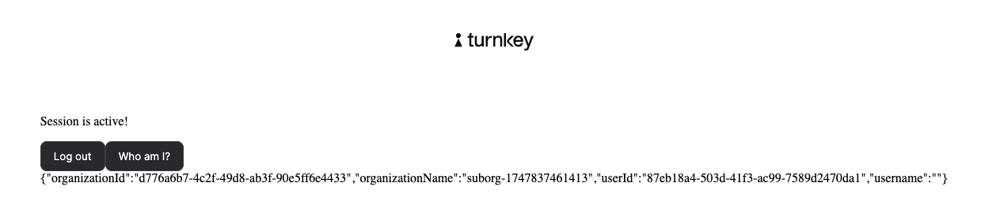

# Example: `with-indexed-db`

This example demonstrates how to create a sub-organization, authenticate with a passkey, and persist the session using **unextractable IndexedDB storage**. This provides a secure, user-friendly authentication flow ideal for modern web apps.

<div>
  
</div>

## 🔧 Features

- Create and authenticate into a Turnkey sub-organization
- Store session securely using unextractable P-256 keys in IndexedDB
- Leverages `@turnkey/sdk-react` and `TurnkeyProvider` for seamless integration

---

## 🏁 Getting Started

### 1. Clone the repo

Make sure you have Node v18+ installed.

```bash
git clone https://github.com/tkhq/sdk
cd sdk/
corepack enable     # Install pnpm if needed
pnpm install -r     # Install dependencies
pnpm run build-all  # Compile the source
cd examples/with-indexed-db/
```

### 2. Set up Turnkey

Before running the app, follow the [Turnkey Quickstart](https://docs.turnkey.com/getting-started/quickstart) to:

- Create an organization
- Generate a P-256 API key pair
- Note your organization ID

Then:

```bash
cp .env.local.example .env.local
```

Edit `.env.local` and fill in the following:

```env
API_PUBLIC_KEY=<your-api-public-key>
API_PRIVATE_KEY=<your-api-private-key> # DO NOT commit this
NEXT_PUBLIC_BASE_URL=https://api.turnkey.com
NEXT_PUBLIC_ORGANIZATION_ID=<your-org-id>
NEXT_PUBLIC_RPID=localhost
```

> **Note:** Your private key is used only in development and must be handled securely. Do not expose it in production builds.

---

### 3. Run the example app

```bash
pnpm run dev
```

Visit [http://localhost:3000](http://localhost:3000) to see the demo in action.

---

## 📁 Project Structure

- `app/layout.tsx` – Wraps the app in a `TurnkeyProvider` using env-based config.
- `app/page.tsx` – Implements the IndexedDB-based passkey login and session creation.
- `components/` – Includes reusable form elements and session status UI.

---

## ✅ Why IndexedDB?

This demo migrates away from iframe-based stamping in favor of IndexedDB for stronger UX and DevEx. Benefits include:

- Persistent, unextractable key storage
- No need for third-party iframe domains
- Seamless integration with modern browsers

---

## 🛡️ Security Note

This example is meant for development and demo purposes. In production:

- Never expose private keys to the browser
- Use a backend proxy to handle sensitive API operations
- Ensure HTTPS is used in all environments

---

## 📚 Learn More

- [Turnkey Docs](https://docs.turnkey.com/)
- [Turnkey GitHub](https://github.com/tkhq/sdk)
- [Web Cryptography API: IndexedDB Storage](https://developer.mozilla.org/en-US/docs/Web/API/CryptoKey#storing_cryptokeys)

---
