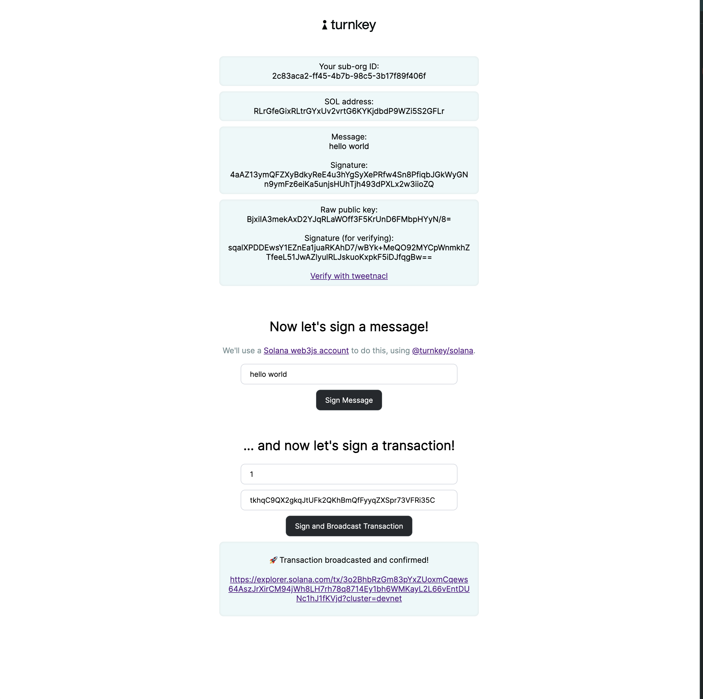

# Solana 🤝 Passkeys

This repo contains a sample application **for demonstration purposes only**, walking through how to create sub-organizations, create a wallet, and sign with the [`@turnkey/solana`](https://github.com/tkhq/sdk/tree/main/packages/solana) signer (with transactions sponsored by the parent org!), using passkeys. Please feel free to play with this example and file an issue if there are improvements to be made! ❤️

<p style="text-align:center">
    
</p>

The flow showcases 3 ways to make requests to Turnkey:

- the initial request to create a new [sub-organization](https://docs.turnkey.com/getting-started/sub-organizations) is authenticated in the NextJS backend with an API signature (using `API_PUBLIC_KEY`/`API_PRIVATE_KEY` from your `.env.local` file)
- the request to log back in is signed on the frontend with your passkey, but it's passed to the NextJS backend as a signed request (the body, stamp, and url are POSTed). This lets the backend submit this request on your behalf, get your sub-organization ID, and fetch details about your wallet (parent organizations have read-only access to their sub-organizations).
- the request to sign a message is done 100% client-side via a Turnkey Solana signer (see [@turnkey/solana](https://github.com/tkhq/sdk/tree/main/packages/solana)): it's signed with your passkey, and submitted from the browser to the Turnkey API directly.
- the request to sign a transaction is also done on the client-side, but the transaction is initially created on the server-side and signed by the fee payer, which is a wallet belonging to the parent org.

If you want to see a Solana demo with API keys instead of passkeys, head to the example [`with-solana`](https://github.com/tkhq/sdk/tree/main/examples/with-solana).

You can try this example quickly on Stackblitz. Follow the instructions below --> [Stackblitz Instructions](#4-stackblitz-example)

## Getting started

### 1/ Clone or fork this repo

Make sure you have `Node.js` installed locally; we recommend using Node v18+.

```bash
$ git clone https://github.com/tkhq/sdk
$ cd sdk/
$ corepack enable  # Install `pnpm`
$ pnpm install -r  # Install dependencies
$ pnpm run build-all  # Compile source code
$ cd examples/with-solana-passkeys/
```

### 2/ Setting up Turnkey

The first step is to set up your Turnkey organization and account. By following the [Quickstart](https://docs.turnkey.com/getting-started/quickstart) guide, you should have:

- A public/private API key pair for Turnkey
- An organization ID

Once you've gathered these values, add them to a new `.env.local` file. Notice that your API private key should be securely managed and **_never_** be committed to git.

```bash
$ cp .env.local.example .env.local
```

Now open `.env.local` and add the missing environment variables:

- `API_PUBLIC_KEY`
- `API_PRIVATE_KEY`
- `NEXT_PUBLIC_BASE_URL`
- `NEXT_PUBLIC_ORGANIZATION_ID`
- `NEXT_PUBLIC_RPID=localhost` # replace with domain in production
- `NEXT_PUBLIC_SERVER_SIGN_URL=http://localhost:3000/api` # replace with backend URL in production
- `NEXT_PUBLIC_FEE_PAYER_ADDRESS="<fee payer address>"` # parent org wallet that pays for fees

### 3/ Running the app

```bash
$ pnpm run dev
```

This command will start a NextJS app on localhost. If you navigate to http://localhost:3000 in your browser, you can follow the prompts to create a sub organization, create a private key for the newly created sub-organization, and sign a message using your passkey with a Solana custom account!

### 4/ Stackblitz Example

Example Link: https://stackblitz.com/edit/stackblitz-starters-h5pmnu

#### Prerequisites

To use the example you need the following

- Turnkey Organization
- API key for the root user (both public and private key needed)
- Solana wallet for Parent org (created within turnkey UI)
- Airdrop devnet SOL to parent org wallet using devnet faucet → https://faucet.solana.com/

#### Set Env Variables

Set the following environment variables in .env.local

- `API_PUBLIC_KEY` → Public key of your API associated with root user
- `API_PRIVATE_KEY` → Private key of your API associated with root user
- `NEXT_PUBLIC_ORGANIZTION_ID` → org ID of the Turnkey organization that you’re using
- `NEXT_PUBLIC_BASE_URL` --> This will be preset with https://api.turnkey.com
- `NEXT_PUBLIC_RPID` --> this should be pre-filled with the value `local-credentialless.webcontainer.io` which is the RPID required in the Stackblitz environment
- `NEXT_PUBLIC_SERVER_SIGN_URL` → fill this out with the url in the browser of Stackblitz followed by “/api” --> for example: https://stackblitzstarters2psu3g-5wkd--3000--134daa3c.local-credentialless.webcontainer.io/api. This needs to be replaced as in the note below
- `NEXT_PUBLIC_FEE_PAYER_ADDRESS` --> the address of the Solana address with airdropped funds

NOTE: when you update `.env.local` file (or any file) in Stackblitz, the project will get forked and a new Stackblitz environment will get created. This means that you'll have to `NEXT_PUBLIC_SERVER_SIGN_URL` will have to be updated to be the Stackblitz environment broswer URL + the suffix "/api"

#### Directions to use

- run `npm install && npm run build && npm run dev"
- follow example flow

# Legal Disclaimer

THE SOFTWARE IS PROVIDED "AS IS", WITHOUT WARRANTY OF ANY KIND, EXPRESS OR IMPLIED, INCLUDING BUT NOT LIMITED TO THE WARRANTIES OF MERCHANTABILITY, FITNESS FOR A PARTICULAR PURPOSE AND NONINFRINGEMENT. IN NO EVENT SHALL TURNKEY BE LIABLE FOR ANY CLAIM, DAMAGES OR OTHER LIABILITY, WHETHER IN AN ACTION OF CONTRACT, TORT OR OTHERWISE, ARISING FROM, OUT OF OR IN CONNECTION WITH THE SOFTWARE OR THE USE OR OTHER DEALINGS IN THE SOFTWARE.
