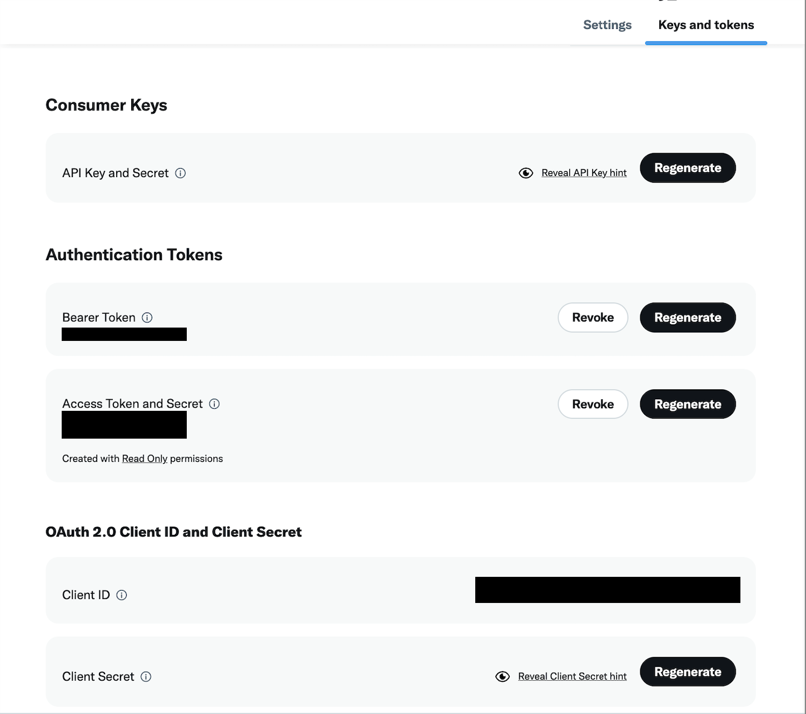
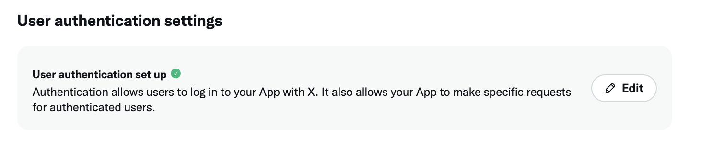
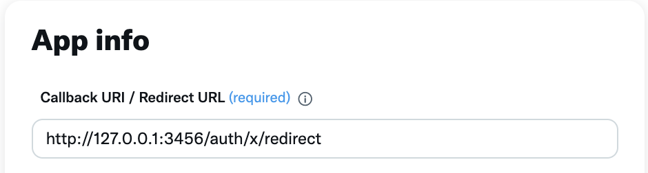

# Example: `with-x`

This example shows a complete the Oauth 2.0 flow with X. It contains a NextJS app with:

- a frontend application
- a backend application

This example contains an example auth page as well as a stub API endpoint for "your business" (where the user is resolved into an organization ID). It relies on the `indexedDbClient` to stamp the requests. For more information on oauth, [check out our documentation](https://docs.turnkey.com/authentication/social-logins).

## Getting started

### 1/ Cloning the example

Make sure you have `node` installed locally; we recommend using Node v18+.

```bash
$ git clone https://github.com/tkhq/sdk
$ cd sdk/
$ corepack enable  # Install `pnpm`
$ pnpm install -r  # Install dependencies
$ pnpm run build-all  # Compile source code
$ cd examples/with-x/
```

### 2/ Setting up Turnkey

The first step is to set up your Turnkey organization and account. By following the [Quickstart](https://docs.turnkey.com/getting-started/quickstart) guide, you should have:

- A public/private API key pair for Turnkey
- An organization ID

Once you've gathered these values, add them to a new `.env.local` file. Notice that your API private key should be securely managed and **_never_** be committed to git.

```bash
$ cp .env.local.example .env.local
```

Now open `.env.local` and add the missing environment variables:

- `API_PUBLIC_KEY`
- `API_PRIVATE_KEY`
- `NEXT_PUBLIC_BASE_URL` (the `NEXT_PUBLIC` prefix makes the env variable accessible to the frontend app)
- `NEXT_PUBLIC_ORGANIZATION_ID`

### 3/ Setting up X

Navigate to the [X developer portal](https://developer.twitter.com/en/portal/dashboard) and create a app. In the keys and tokens section you'll need to save your:

- Client ID
- Client Secret



You will also need to set a Redirect URI found in the `User authentication settings` tab.



For this demo application set your Callback URI / Redirect URL to the following:
`http://127.0.0.1:3456/auth/x/redirect`.

Ensure to use `127.0.0.1` and NOT `localhost`. The port used in your `X_REDIRECT_URI` should match the `PORT` value in your .env.local file.



After you have obtained these values save them in your .env.local

- X_CLIENT_ID
- X_REDIRECT_URI

### 4/ Upload your client secret

To enable Turnkey to perform OAuth 2.0 authentication for your end users, our secure enclave will need access to your X client secret. This step will outline the process of passing it encrypted to our TLS Fetcher enclave, our enclave responsible for making external requests, in this case to X.

This client secret is never decrypted outside of our secure enclave and no individual has access to this secret.

To encrypt your client secret and upload it to Turnkey ensure you have the following environment variables setup in your .env.local file .

- API_PUBLIC_KEY
- API_PRIVATE_KEY
- NEXT_PUBLIC_ORGANIZATION_ID
- NEXT_PUBLIC_BASE_URL
- X_CLIENT_ID

Run `pnpm run credential-upload -- <client_secret>` and do NOT include the `<>` with your X client secret. You can view the script that performs this encryption at [credential-upload.tsx](./credential-upload.tsx). If your client secret is `123` you'll run `pnpm run credential-upload -- 123`.

This script will output an OAuth 2.0 Credential ID. Paste this value in your .env.local file for the OAUTH2_CREDENTIAL_ID environment variable.

### 4/ Running the app

You should now have all of the environment variables in .env.local populated. You're now ready to run the application!

```bash
pnpm run dev
```

This command will run a NextJS app on port 3456. If you navigate to http://localhost:3456 in your browser, you can follow the prompts to sign in with X.
