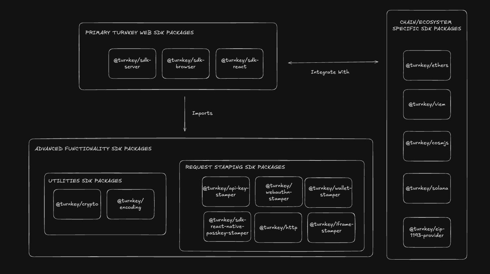

  
# Turnkey SDK

## Overview

The Turnkey SDK includes functionality to interact with Turnkey in various contexts and ecosystems. It consists of three main NPM package groups.

- the [Primary Turnkey Web SDK Packages](#primary-turnkey-web-sdk-packages) which expose the main functionality required to build Turnkey-powered applications in different web environments
- the [Chain/Ecosystem-Specific Signing Packages](#chainecosystem-specific-signing-sdk-packages) which expose signers with support for specific ecosystems, built on top of our Web SDK packages
- the [Advanced Functionality SDK Packages](#advanced-functionality-sdk-packages) which exposes lower level functionality that is leveraged by our Primary Web SDK Packages for those with highly-specific implementations looking to use them.

The diagram below helps visualize the packages in our SDK organized by the functionality they expose.

## Primary Turnkey Web SDK Packages

The following packages expose the main functionality required to build Turnkey-powered applications. Each package exposes functions, and/or client classes with methods that manage the process of authenticating requests to the Turnkey API in the contexts of a generic browser environment or react client environment, or a server environment.

While these higher level packages are the main points of reference to be used while designing and building Turnkey applications, they wrap other packages with lower level functionality which we also expose separately for those who would like to explore them for more specialized use cases. These packages are listed and described below in the [Advanced Functionality SDK Packages](#advanced-functionality-sdk-packages) section.

Our main web SDK packages are as follows:

| Package                                                                          | Description                                                                                                                                                                                                                                                                                                                                                                                                                                                                                                                                                                                                                                                                                                                                                                            | NPM                                                                                                                           | Changelog                                       | Docs                                                     |
| -------------------------------------------------------------------------------- | -------------------------------------------------------------------------------------------------------------------------------------------------------------------------------------------------------------------------------------------------------------------------------------------------------------------------------------------------------------------------------------------------------------------------------------------------------------------------------------------------------------------------------------------------------------------------------------------------------------------------------------------------------------------------------------------------------------------------------------------------------------------------------------- | ----------------------------------------------------------------------------------------------------------------------------- | ----------------------------------------------- | -------------------------------------------------------- |
| [@turnkey/sdk-browser](/packages/sdk-browser)                                    | The `@turnkey/sdk-browser` package exposes functionality that lets developers build browser based applications that interact with the Turnkey API with different types of authentication. It consists of different clients that enable requests to the API to be authenticated via different auth methods like user sessions, passkeys and iFrames. It also contains methods to manage information and state related to authentication like auth bundles and sessions, retrieving user information and server signing API requests.                                                                                                                                                                                                                                                    |       | [changelog](/packages/sdk-browser/changelog.md) | [Docs](https://docs.turnkey.com/sdks/javascript-browser) |
| [@turnkey/sdk-server](https://github.com/tkhq/sdk/tree/main/packages/sdk-server) | The `@turnkey/sdk-server` package exposes functionality that lets developers build server-side functionality for applications that interact with the Turnkey API with different types of authentication – allowing applications to authenticate users, manage sessions, and perform organizational operations securely and efficiently. It consists of an API Client and API Proxies that enable requests to the Turnkey API to be authenticated with the appropriate credentials. Specifically, the API Client manages requests signed by the user's authentication details, and the API proxies handle requests signed by the parent organization's authentication details. Use this package to handle server-side interactions for applications that interact with the Turnkey API. |  | [changelog](/packages/sdk-server/changelog.md)  | [Docs](https://docs.turnkey.com/sdks/javascript-server)  |
| [@turnkey/sdk-react](https://github.com/tkhq/sdk/tree/main/packages/sdk-react)   | The `@turnkey/sdk-react` package wraps the functionality from the `@turnkey/sdk-browser` package to allow developers to build react based applications that interact with the Turnkey API with different types of authentication. It allows developers to use the same clients exposed in `@turnkey/sdk-browser` that enable requests to the API to be authenticated via different auth methods like user sessions, passkey and iFrames. It also contains the same methods to manage information and state related to authentication like auth bundles and sessions, retrieving user information and server signing API requests. Use this package when you're building React-based frontend applications that interact with the Turnkey API.                                          |    | [changelog](/packages/sdk-react/changelog.md)   | [Docs](https://docs.turnkey.com/sdks/react)              |

The diagram below helps visualize how each package can be used to devlop the appropriate service in your Turnkey Powered Application, and how Turnkey requests would flow between those services.

## Chain/Ecosystem-Specific Signing SDK Packages

The following packages contain chain or ecosystem specific signers that take some of our [Primary Turnkey Web SDK Packages](#primary-turnkey-web-sdk-packages) (usually @turnkey/sdk-browser or @turnkey/sdk-server) and add additional support based on the signing process or transaction structure relevant to that specific chain or ecosystem.

| Package                                                     | NPM                                                                                                                                         | Description                          | Changelog                                             |
| ----------------------------------------------------------- | ------------------------------------------------------------------------------------------------------------------------------------------- | ------------------------------------ | ----------------------------------------------------- |
| [`@turnkey/ethers`](/packages/ethers)                       |                        | Turnkey Signer for Ethers            | [changelog](/packages/ethers/changelog.md)            |
| [`@turnkey/viem`](/packages/viem)                           |                            | Turnkey Signer for Viem              | [changelog](/packages/viem/changelog.md)              |
| [`@turnkey/cosmjs`](/packages/cosmjs)                       |                        | Turnkey Signer for CosmJS            | [changelog](/packages/cosmjs/changelog.md)            |
| [`@turnkey/solana`](/packages/solana)                       |                        | Turnkey Signer for Solana            | [changelog](/packages/solana/changelog.md)            |
| [`@turnkey/eip-1193-provider`](/packages/eip-1193-provider) |  | Turnkey-compatible EIP-1193 Provider | [changelog](/packages/eip-1193-provider/changelog.md) |

## Advanced Functionality SDK Packages

For those with more specialized use cases, Turnkey exposes it's lower level-libraries stamping and encryption libraries to be used directly. Note: for most use-cases, these libraries are not meant to be used directly and we encourage working on designing your application mainlyusing our [Primary Turnkey Web SDK Packages](#primary-turnkey-web-sdk-packages) along with our [Chain and Ecosystem Specific SDK Packages](#chainecosystem-specific-signing-sdk-packages) as per your use case!

### Request Stamping

| Package                                                                                | NPM                                                                                                                                                               | Description                                                                | Changelog                                                        | Docs                                                            |
| -------------------------------------------------------------------------------------- | ----------------------------------------------------------------------------------------------------------------------------------------------------------------- | -------------------------------------------------------------------------- | ---------------------------------------------------------------- | --------------------------------------------------------------- |
| [`@turnkey/http`](/packages/http)                                                      |                                                  | Lower-level, fully typed HTTP client for interacting with Turnkey API      | [changelog](/packages/http/changelog.md)                         | [Docs](https://docs.turnkey.com/sdks/advanced/turnkey-client)   |
| [`@turnkey/api-key-stamper`](/packages/api-key-stamper)                                |                            | Provide API key signatures over Turnkey requests                           | [changelog](/packages/api-key-stamper/changelog.md)              | [Docs](https://docs.turnkey.com/sdks/advanced/api-key-stamper)  |
| [`@turnkey/iframe-stamper`](/packages/iframe-stamper)                                  |                              | Provide API key signatures over Turnkey requests within iframe contexts    | [changelog](/packages/iframe-stamper/changelog.md)               | [Docs](https://docs.turnkey.com/sdks/advanced/iframe-stamper)   |
| [`@turnkey/webauthn-stamper`](/packages/webauthn-stamper)                              |                          | Provide Webauthn signatures over Turnkey requests                          | [changelog](/packages/webauthn-stamper/changelog.md)             | [Docs](https://docs.turnkey.com/sdks/advanced/webauthn-stamper) |
| [`@turnkey/wallet-stamper`](/packages/wallet-stamper)                                  |                              | Provide wallet signatures over Turnkey requests                            | [changelog](/packages/wallet-stamper/changelog.md)               | [Docs](https://docs.turnkey.com/sdks/advanced/wallet-stamper)   |
| [`@turnkey/sdk-react-native-passkey-stamper`](/packages/react-native-passkey-stamper/) |  | Provide Passkey signatures over Turnkey requests in a React Native context | [changelog](/packages/react-native-passkey-stamper/changelog.md) | [Docs](https://docs.turnkey.com/sdks/react-native)              |

### Utilities

| Package                                   | NPM                                                                                                                       | Description                                                       | Changelog                                    |
| ----------------------------------------- | ------------------------------------------------------------------------------------------------------------------------- | ----------------------------------------------------------------- | -------------------------------------------- |
| [`@turnkey/encoding`](/packages/encoding) |  | Encoding and decoding utilities, primarily for internal usage     | [changelog](/packages/encoding/changelog.md) |
| [`@turnkey/crypto`](/packages/crypto)     |      | Cryptographic utilities for P256 keys, encryption, and decryption | [changelog](/packages/crypto/changelog.md)   |

## Code Examples

### Instant examples (powered by Stackblitz)

The following code examples have been loaded into Stackblitz web environments so you can test them out immediately

| Example                                                           | Description                                                                                                                             | Stackblitz Link                                                                      |
| ----------------------------------------------------------------- | --------------------------------------------------------------------------------------------------------------------------------------- | ------------------------------------------------------------------------------------ |
| [`email-auth-local-storage`](/examples/email-auth-local-storage/) | A NextJS app demonstrating a complete email auth flow using a locally stored target embedded key                                        | [Test it out on Stackblitz!](https://stackblitz.com/edit/stackblitz-starters-pyyw59) |
| [`with-eth-passkey-signers`](/examples/with-eth-passkey-signers/) | A NextJS app powering users to create suborgs and sign messages via Viem or Ethers                                                      | [Test it out on Stackblitz!](https://stackblitz.com/edit/stackblitz-starters-2psu3g) |
| [`with-solana`](/examples/with-solana/)                           | Create a new Solana address, then sign and broadcast a transaction on Solana's devnet                                                   | [Test it out on Stackblitz!](https://stackblitz.com/edit/stackblitz-starters-xeb93i) |
| [`with-solana-passkeys`](/examples/with-solana-passkeys/)         | A NextJS app powering users to create suborgs, sign messages, and create transactions sponsored by the parent org using @turnkey/solana | [Test it out on Stackblitz!](https://stackblitz.com/edit/stackblitz-starters-h5pmnu) |

### Other Code Examples

The below examples will require a local installation of `node.js`. Follow the specific instructions in the respective readme's of each examples to run them!

| Example                                                                                    | Description                                                                                                                                                                              |
| ------------------------------------------------------------------------------------------ | ---------------------------------------------------------------------------------------------------------------------------------------------------------------------------------------- |
| [`demo-consumer-wallet`](https://github.com/tkhq/demo-consumer-wallet)                     | A minimal consumer wallet app powered by Turnkey and WalletConnect                                                                                                                       |
| [`demo-passkey-wallet`](https://github.com/tkhq/demo-passkey-wallet)                       | A minimal consumer wallet app powered by Turnkey and passkeys                                                                                                                            |
| [`demo-ethers-passkeys`](https://github.com/tkhq/demo-ethers-passkeys)                     | A NextJS app that demonstrates how to use `@turnkey/ethers` to build a passkey-powered application                                                                                       |
| [`demo-viem-passkeys`](https://github.com/tkhq/demo-viem-passkeys)                         | A NextJS app that demonstrates how to use `@turnkey/viem` to build a passkey-powered application                                                                                         |
| [`react-native-demo-wallet`](https://github.com/tkhq/react-native-demo-wallet)             | A React Native app that demonstrates how to use the Turnkey's JavaScript packages in a mobile environment to authenticate users, create wallets, export wallets, sign messages, and more |
| [`flutter-demo-app`](https://github.com/tkhq/dart-sdk/tree/main/examples/flutter-demo-app) | A Flutter app that demonstrates how to use the Turnkey's Flutter packages to authenticate users, create wallets, export wallets, sign messages, and more                                 |
| [`deployer`](/examples/deployer/)                                                          | Compile and deploy a smart contract                                                                                                                                                      |
| [`email-auth`](/examples/email-auth/)                                                      | A NextJS app demonstrating a complete email auth flow using Turnkey iframes                                                                                                              |
| [`wallet-import-export`](/examples/wallet-import-export/)                                  | A NextJS app demonstrating complete wallet import and export flows                                                                                                                       |
| [`rebalancer`](/examples/rebalancer/)                                                      | A demo application which showcases an example of how to use Turnkey for managing multiple types of keys & users                                                                          |
| [`sweeper`](/examples/sweeper/)                                                            | Sweep funds from one address to a different address                                                                                                                                      |
| [`trading-runner`](/examples/trading-runner/)                                              | A sample application demonstrating a trading operation, using various private keys, users, and policies, powered by Uniswap                                                              |
| [`with-ethers`](/examples/with-ethers/)                                                    | Create a new Ethereum address, then sign and broadcast a transaction using the Ethers signer with Infura                                                                                 |
| [`with-viem`](/examples/with-viem/)                                                        | Sign and broadcast a transaction using the Turnkey Custom Account and Infura                                                                                                             |
| [`with-cosmjs`](/examples/with-cosmjs/)                                                    | Create a new Cosmos address, then sign and broadcast a transaction on Celestia testnet using the CosmJS signer                                                                           |
| [`with-bitcoin`](/examples/with-bitcoin/)                                                  | Create a new wallet, derive a BTC address, create, sign, and broadcast a transaction using BitcoinJS and other external APIs                                                             |
| [`with-biconomy-aa`](/examples/with-biconomy-aa/)                                          | Create a new wallet, connect a Turnkey wallet client to Biconomy Nexus, and create, sign, and broadcast an EIP-1559 transaction                                                          |
| [`with-zerodev-aa`](/examples/with-zerodev-aa/)                                            | Create a new wallet, instantiate a Turnkey signer, create a ZeroDev kernel account and client, and broadcast a UserOp                                                                    |
| [`with-gnosis`](/examples/with-gnosis/)                                                    | Create new Ethereum addresses, configure a 3/3 Gnosis safe, and create + execute a transaction from it                                                                                   |
| [`with-uniswap`](/examples/with-uniswap/)                                                  | Sign and broadcast a Uniswap v3 trade using the Ethers signer with Infura                                                                                                                |
| [`with-nonce-manager`](/examples/with-nonce-manager/)                                      | Create a new Ethereum address, then sign and broadcast multiple transactions in a sequential or optimistic manner                                                                        |
| [`with-offline`](/examples/with-offline/)                                                  | Sign a Turnkey request in offline context                                                                                                                                                |
| [`with-federated-passkeys`](/examples/with-federated-passkeys/)                            | A NextJS app that demonstrates how to use Turnkey to build a federated, webauthn powered authentication flow                                                                             |
| [`with-eip-1193-provider`](/examples/with-eip-1193-provider/)                              | A NextJS app that demonstrates how to use Turnkey the `@turnkey/eip-1193-provider` in your app                                                                                           |
| [`with-wallet-stamper`](/examples/with-wallet-stamper/)                                    | A NextJS app that demonstrates how to use Turnkey the `@turnkey/wallet-stamper` in your app                                                                                              |

## Demos built with Turnkey

### Demo Consumer Wallet ([code](https://github.com/tkhq/demo-consumer-wallet))

A minimal consumer wallet app powered by Turnkey. Behind the scenes, it uses [`@turnkey/ethers`](https://www.npmjs.com/package/@turnkey/ethers) for signing and WalletConnect (v1) for accessing dapps.

https://github.com/tkhq/demo-consumer-wallet/assets/127255904/2c3409df-2d7c-4ec3-9aa8-e2944a0b0e0a

See https://github.com/tkhq/demo-consumer-wallet for the code.

### Demo Passkey Wallet ([code](https://github.com/tkhq/demo-passkey-wallet), [live link](https://wallet.tx.xyz))

A wallet application showing how users can register and authenticate using passkeys.
This demo uses the Turnkey API to create a new [Turnkey Sub-Organization](https://docs.turnkey.com/concepts/sub-organizations) for each user, create a testnet Ethereum address and send a transaction on Sepolia (ETH testnet).

See https://wallet.tx.xyz (and https://github.com/tkhq/demo-passkey-wallet for the code).

### Demo Ethers Passkeys ([code](https://github.com/tkhq/demo-ethers-passkeys))

A simple application demonstrating how to create sub-organizations, create private keys, and sign with the [`@turnkey/ethers`](https://github.com/tkhq/sdk/tree/main/packages/ethers) signer, using passkeys.

See https://github.com/tkhq/demo-ethers-passkeys for the code.

### Demo Viem Passkeys ([code](https://github.com/tkhq/demo-viem-passkeys))

A similar, simple application demonstrating how to create sub-organizations, create private keys, and sign with the [`@turnkey/viem`](https://github.com/tkhq/sdk/tree/main/packages/viem) signer, using passkeys.

See https://github.com/tkhq/demo-viem-passkeys for the code.

### React Native Demo App ([code](https://github.com/tkhq/react-native-demo-wallet))

A React Native app that demonstrates how to use the Turnkey's JavaScript packages in a mobile environment to authenticate users, create wallets, export wallets, sign messages, and more

https://github.com/user-attachments/assets/e4cff012-11e9-4636-b67a-5dbf75355832

See https://github.com/tkhq/react-native-demo-wallet for the code.

### Flutter Demo App ([code](https://github.com/tkhq/dart-sdk/tree/main/examples/flutter-demo-app))

A Flutter app that demonstrates how to use the Turnkey's Flutter packages to authenticate users, create wallets, export wallets, sign messages, and more

https://github.com/user-attachments/assets/3d583ed8-1eff-4101-ae43-3c76c655e635

See https://github.com/tkhq/dart-sdk/tree/main/examples/flutter-demo-app for the code
